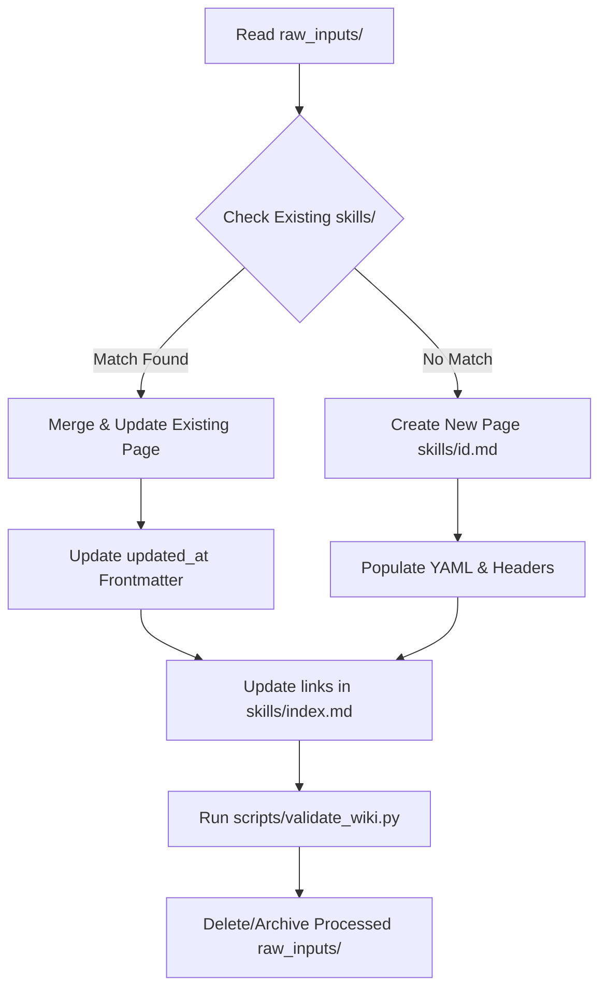

# Community Skills LLM-Wiki

This repository implements a **Karpathy-style LLM-Wiki**—a persistent, compounding knowledge base of developer and AI agent skills. 

Rather than relying on transient chat histories or stateless Retrieval-Augmented Generation (RAG) which "forgets" information between queries, this system compiles raw, unstructured information into a structured, highly interlinked codebase of Markdown files.

## Philosophy: Compile Once, Query Forever
- **Raw Inputs (`raw_inputs/`)**: The "source code." Raw community proposals, crawled web pages, logs, and suggestions. These are read-only for the compiler and are processed asynchronously.
- **The Wiki (`skills/`)**: The "compiled binary." A flat, structured collection of markdown files. Pages are interlinked using relative links and Obsidian-style double brackets to build a strong semantic graph of skills.
- **The Agents**: The "compilers." AI agents ingest new raw files, check for duplicates, update relevant wiki files, establish links, and update the catalog index.
- **The Validator (`scripts/validate_wiki.py`)**: The "linter." Ensures the database contains no broken links, all files comply with the frontmatter schema, and the main index is kept in sync.

---

## Directory Structure

```
├── README.md                   # Shared Agent Manual (this file)
├── GEMINI.md                   # Developer & Agent execution commands
├── skills/                     # The compiled skills database
│   ├── index.md                # Central catalog and dependency graph
│   ├── git-basics.md           # Seed page (Beginner)
│   └── prompt-engineering.md   # Seed page (Intermediate)
├── raw_inputs/                 # Ingest queue for crawler agents
│   └── .gitkeep                # Placeholder
└── scripts/                    # Validation and automation utilities
    └── validate_wiki.py        # Wiki integrity validator
```

---

## Skill Page Specification

Every file in the `skills/` directory (except `index.md`) must represent a single, atomic skill and follow this exact template:

### 1. File Naming
The file name must match the skill ID exactly: `skills/{id}.md` (lowercase, hyphens instead of spaces, e.g., `prompt-engineering.md`).

### 2. YAML Frontmatter
The file must start and end with `---` boundaries containing these key-value pairs:
```yaml
id: unique-kebab-case-identifier
title: Title of the Skill in Title Case
category: High Level Category Group
created_at: YYYY-MM-DD
updated_at: YYYY-MM-DD
difficulty: Beginner | Intermediate | Advanced
tags:
  - tag-one
  - tag-two
```

### 3. Markdown Headers
The body must contain the following standard Markdown headers (in this order):
- `# Skill Title` (H1)
- `## Overview`: High-level summary of what the skill is and why it matters.
- `## Prerequisites`: List of prior knowledge required. Highly encouraged to link to other skills using relative markdown links (e.g., `[Git Basics](git-basics.md)`) or Obsidian links (e.g., `[[git-basics|Git Basics]]`).
- `## Core Concepts`: Bulleted definitions of terms and theoretical foundation.
- `## In-Depth Guide`: Actionable guide, terminal commands, configurations, and code blocks showing how to perform the skill.
- `## Verification`: Clear instruction checklist on how to verify that the skill has been successfully applied or executed.

---

## Agent Compilation Workflow

Ingestion/Compiler agents must follow this multi-step protocol when consuming files from `raw_inputs/`:



### Step 1: Scan and Read
Read files placed in `raw_inputs/` (placed by crawler agents). Parse their content, titles, and tags.

### Step 2: Deduplication and Categorization
Search the current `skills/` folder to check if this skill is:
1. **Already present**: If yes, **merge** the new details into the existing file instead of creating a duplicate. Update the `updated_at` field in the frontmatter.
2. **A brand new skill**: Create a new `{id}.md` file based on the template. Choose an appropriate high-level category.

### Step 3: Establish Cross-Links
Scan the content of the new or updated skill. If it mentions terms or technologies matching other existing skill files (e.g., git, docker, prompts), add internal links:
- Standard markdown: `[Git Basics](git-basics.md)`
- Obsidian brackets: `[[git-basics|Git Basics]]`

### Step 4: Compile index.md
Modify `/skills/index.md` to:
1. Increment the **`Total Skills: X`** stat.
2. Add the skill under the appropriate header in the **Categorized Catalog**.
3. If there are prerequisites, update the **Skill Dependency Graph** (using Mermaid markup).

### Step 5: Verification and Cleanup
1. Run `python3 scripts/validate_wiki.py` to ensure the wiki compile contains no errors.
2. Once validation passes, remove the parsed file from `raw_inputs/`.

---

## Wiki Validation & Manifest Generation

The validation script is located at `scripts/validate_wiki.py`. It is a dependency-free python tool. 

It checks:
- **YAML Format**: Presence of all required fields in the frontmatter.
- **File Integrity**: Checks that `{id}` matches the filename.
- **Link Integrity**: Checks that all relative link targets (`*.md`) or Obsidian brackets actually exist in `/skills`.
- **Index Check**: Verifies the declared total skills match the folder count and checks for unlinked pages.
- **Manifest Updates**: Automatically compiles and updates the machine-readable `skills/manifest.json` file on success.

To run:
```bash
python3 scripts/validate_wiki.py
```
If errors are found, the script outputs them and exits with code `1` (indicating compilation failure). On success, it writes out the updated manifest file.

---

## Distributing and Sharing Skills

This repository is organized to act as a central skills hub. Other projects can discover and install skills either programmatically or via a CLI installer script.

### 1. Programmatic Discovery (`skills/manifest.json`)
The repository contains a machine-readable JSON catalog at `skills/manifest.json`. This index allows developers and AI agents to discover available skills without parsing all markdown files.

**JSON Manifest Schema:**
```json
{
  "skills": [
    {
      "id": "skill-id",
      "title": "Human Readable Title",
      "description": "Short summary of the skill.",
      "category": "Category Group",
      "difficulty": "Beginner | Intermediate | Advanced",
      "tags": ["tag1", "tag2"],
      "filePath": "skills/skill-id.md"
    }
  ]
}
```

### 2. Skill Installer CLI (`scripts/install.py`)
A standalone, zero-dependency Python script is provided at `scripts/install.py` to search and install skills.

- **List all skills:**
  ```bash
  python3 scripts/install.py --list
  ```
- **Search skills by keyword (matches title, description, category, or tags):**
  ```bash
  python3 scripts/install.py --search alignment
  ```
- **Install a skill to a target project:**
  ```bash
  # Installs 'grill-me' into target project's Claude skills directory
  python3 scripts/install.py --install grill-me --dest /path/to/my-project/.claude/skills
  ```

---

## Instructions for AI Agents (Autonomous Installation)

AI agents (like Antigravity or Claude Code) can check out this repository and integrate skills autonomously into a user's local project workspace:

### Method A: Direct Remote Fetching (Recommended)
An agent can query the raw GitHub content directly to find and download a skill without cloning the whole repository:
1. **Fetch the manifest** from the raw URL to find matching skills:
   `https://raw.githubusercontent.com/<owner>/<repo>/main/skills/manifest.json`
2. **Download the skill file** using its `filePath` field from the manifest entry:
   `https://raw.githubusercontent.com/<owner>/<repo>/main/skills/<skill-id>.md`
3. **Save it** in the user's project skill configuration directory (e.g. `.claude/skills/<skill-id>.md` or `.cursor/skills/<skill-id>.md`).

### Method B: Local Execution (Using the script)
If the agent already has a local clone or access to the repository:
1. Run the installer script with `--list` or `--search` to discover skills.
2. Run the `--install` command with the target destination parameter:
   ```bash
   python3 scripts/install.py --install <skill-id> --dest <user-project-root>/.claude/skills
   ```

---

## Example Simulated Use Case

Here is an example demonstrating how an AI agent interacts with this repository autonomously:

### Scenario
A user prompts their local AI agent:
> *"Identify which skills listed in this repository are relevant for our project of developing a full stack application using Node.js and hosting on Firebase. Download and install those relevant skills into our local project so the development agent can use them."*

### Execution Flow
1. **Manifest Retrieval**: The agent fetches `skills/manifest.json` from the repository:
   ```bash
   curl -fsSL https://raw.githubusercontent.com/georg/intelligent-planck/main/skills/manifest.json
   ```
2. **Relevance Selection**: The agent parses the manifest and selects matching skills:
   - `grill-me`: To Socratic-interview the user about architectural choices (Firestore vs. Realtime DB, Firebase Functions vs. hosting).
   - `superpowers`: To coordinate developer and reviewer subagents.
   - `test-driven-development`: To ensure backend Node.js APIs are robust.
   - `diagnose`: To systematically debug runtime or deployment issues.
   - `goal-driven-execution`: To handle automated background deploy tasks.
3. **Automated Download**: The agent downloads the matching `.md` files directly into `.claude/skills/`:
   ```bash
   mkdir -p .claude/skills
   curl -fsSL https://raw.githubusercontent.com/georg/intelligent-planck/main/skills/grill-me.md -o .claude/skills/grill-me.md
   curl -fsSL https://raw.githubusercontent.com/georg/intelligent-planck/main/skills/superpowers.md -o .claude/skills/superpowers.md
   curl -fsSL https://raw.githubusercontent.com/georg/intelligent-planck/main/skills/test-driven-development.md -o .claude/skills/test-driven-development.md
   curl -fsSL https://raw.githubusercontent.com/georg/intelligent-planck/main/skills/diagnose.md -o .claude/skills/diagnose.md
   curl -fsSL https://raw.githubusercontent.com/georg/intelligent-planck/main/skills/goal-driven-execution.md -o .claude/skills/goal-driven-execution.md
   ```
4. **Integration**: The local agent informs the user that the skills have been configured and are active in their workspace.


