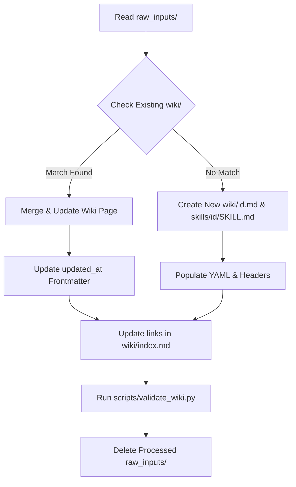

# Community Skills Hub: Metadata Wiki & Executable Agent Skills

This repository implements a split-architecture **Karpathy-style LLM-Wiki** and **Executable Agent Skills Database**.

Rather than mixing human-facing explanations with execution prompts (which bloats context windows and confuses agents), this system decouples metadata and documentation from executable prompts:
1. **The LLM-Wiki (`wiki/`)**: A rich, interlinked knowledge base for humans and searching agents to discover, learn, and evaluate skills. Uses full YAML metadata.
2. **Executable Agent Skills (`skills/`)**: Contains minimal directories with `SKILL.md` files formatted specifically for agent execution (Gemini/Antigravity/Claude format). Uses standard, minimal YAML.

---

## Directory Structure

```
├── README.md                   # Shared Agent Manual (this file)
├── GEMINI.md                   # Developer & Agent execution commands
├── wiki/                       # Rich, searchable user-facing metadata
│   ├── index.md                # Central catalog and dependency graph
│   ├── git-basics.md           # Wiki documentation page
│   └── prompt-engineering.md   # Wiki documentation page
├── skills/                     # Executable agent skill directories
│   ├── manifest.json           # Machine-readable catalog manifest
│   ├── git-basics/             
│   │   └── SKILL.md            # Executable instructions
│   └── prompt-engineering/     
│       └── SKILL.md            # Executable instructions
├── raw_inputs/                 # Ingest queue for crawler agents
└── scripts/                    # Validation and automation utilities
    ├── validate_wiki.py        # Database integrity validator & manifest compiler
    └── install.py              # CLI installer script
```

---

## Folder Specifications

### 1. Wiki Page Specification (`wiki/{id}.md`)
Every file in the `wiki/` directory (except `index.md`) represents a single, atomic skill's rich documentation. It must follow this template:
- **YAML Frontmatter**:
  ```yaml
  ---
  id: unique-kebab-case-identifier
  title: Title of the Skill in Title Case
  category: High Level Category Group
  created_at: YYYY-MM-DD
  updated_at: YYYY-MM-DD
  difficulty: Beginner | Intermediate | Advanced
  tags:
    - tag-one
    - tag-two
  ---
  ```
- **Markdown Headers**:
  - `# Title` (H1)
  - `## Overview`: High-level summary of what the skill is.
  - `## Prerequisites`: List of prior knowledge. Links to other wiki pages (e.g. `[Git Basics](git-basics.md)`).
  - `## Core Concepts`: Definitions of terms.
  - `## In-Depth Guide`: Detailed usage instructions, commands, and code blocks.
  - `## Verification`: Standard check-list to verify if the skill worked.

### 2. Executable Skill Specification (`skills/{id}/SKILL.md`)
Every directory under `skills/` must match a wiki `{id}` and contain a `SKILL.md` file designed for direct consumption by Gemini CLI, Antigravity, or Claude Code:
- **YAML Frontmatter**:
  ```yaml
  ---
  name: unique-kebab-case-identifier
  description: Brief agent-focused trigger description (<200 characters).
  ---
  ```
- **Markdown Body**: Contains ONLY the concise instructions, prompts, and rules the agent should follow when executing the skill.

---

## Agent Compilation & Ingestion Workflow

When compiler agents process raw inputs, they follow this multi-step protocol:



---

## Wiki Validation & Manifest Generation

The validation script is located at `scripts/validate_wiki.py`. It is a dependency-free python tool. 

It checks:
- **Wiki YAML Format**: Verifies the presence of all required fields in `wiki/*.md`.
- **Executable Matching**: Verifies that for every `wiki/{id}.md` page, a matching folder `skills/{id}/` exists containing a valid `SKILL.md`.
- **Executable YAML Format**: Checks that `SKILL.md` contains `name` matching the folder ID, and `description` under 200 characters.
- **Link Integrity**: Checks that all relative link targets (`*.md`) or Obsidian brackets inside `wiki/` actually exist.
- **Manifest Updates**: Automatically compiles and updates the machine-readable `skills/manifest.json` file on success.

To run:
```bash
python3 scripts/validate_wiki.py
```

---

## Distributing and Sharing Skills

This repository is organized to act as a central skills hub. Other projects can discover and install skills either programmatically or via a CLI installer script.

### 1. Programmatic Discovery (`skills/manifest.json`)
The repository contains a machine-readable JSON catalog at `skills/manifest.json`. This index allows developers and AI agents to discover available skills without parsing all markdown files.

**JSON Manifest Schema:**
```json
{
  "skills": [
    {
      "id": "skill-id",
      "title": "Human Readable Title",
      "description": "Short trigger description.",
      "category": "Category Group",
      "difficulty": "Beginner | Intermediate | Advanced",
      "tags": ["tag1", "tag2"],
      "wikiPath": "wiki/skill-id.md",
      "filePath": "skills/skill-id/SKILL.md"
    }
  ]
}
```

### 2. Skill Installer CLI (`scripts/install.py`)
A standalone, zero-dependency Python script is provided at `scripts/install.py` to search and install skills.

- **List all skills:**
  ```bash
  python3 scripts/install.py --list
  ```
- **Search skills by keyword:**
  ```bash
  python3 scripts/install.py --search alignment
  ```
- **Install a skill to a target project:**
  ```bash
  # Installs 'grill-me' into target project's skills directory as .claude/skills/grill-me/SKILL.md
  python3 scripts/install.py --install grill-me --dest /path/to/my-project/.claude/skills
  ```

---

## Instructions for AI Agents (Autonomous Installation)

AI agents can query this repository and integrate skills autonomously into a user's local project workspace:

### Method A: Direct Remote Fetching (Recommended)
An agent can query the raw GitHub content directly to find and download a skill without cloning the whole repository:
1. **Fetch the manifest** from the raw URL to find matching skills:
   `https://raw.githubusercontent.com/a1ag3ntdav3/agent-skill-collection/main/skills/manifest.json`
2. **Download the skill file** using the `filePath` field from the manifest entry:
   `https://raw.githubusercontent.com/a1ag3ntdav3/agent-skill-collection/main/skills/<skill-id>/SKILL.md`
3. **Save it** in the user's project skill configuration directory under a subdirectory matching the skill ID:
   (e.g. `<user-project-root>/.claude/skills/<skill-id>/SKILL.md` or `<user-project-root>/.agents/skills/<skill-id>/SKILL.md`).

---

## Example Simulated Use Case

### Scenario
A user prompts their local AI agent:
> *"Identify which skills listed in this repository are relevant for our project of developing a full stack application using Node.js and hosting on Firebase. Download and install those relevant skills into our local project so the development agent can use them."*

### Execution Flow
1. **Manifest Retrieval**: The agent fetches `skills/manifest.json` from the repository:
   ```bash
   curl -fsSL https://raw.githubusercontent.com/a1ag3ntdav3/agent-skill-collection/main/skills/manifest.json
   ```
2. **Relevance Selection**: The agent parses the manifest and selects matching skills:
   - `grill-me`: To Socratic-interview the user about architectural choices (Firestore vs. Realtime DB, Firebase Functions vs. hosting).
   - `superpowers`: To coordinate developer and reviewer subagents.
   - `test-driven-development`: To ensure backend Node.js APIs are robust.
   - `diagnose`: To systematically debug runtime or deployment issues.
   - `goal-driven-execution`: To handle automated background deploy tasks.
3. **Automated Download**: The agent downloads the matching `SKILL.md` files directly into `.claude/skills/<skill-id>/SKILL.md`:
   ```bash
   mkdir -p .claude/skills/grill-me .claude/skills/superpowers .claude/skills/test-driven-development .claude/skills/diagnose .claude/skills/goal-driven-execution

   curl -fsSL https://raw.githubusercontent.com/a1ag3ntdav3/agent-skill-collection/main/skills/grill-me/SKILL.md -o .claude/skills/grill-me/SKILL.md
   curl -fsSL https://raw.githubusercontent.com/a1ag3ntdav3/agent-skill-collection/main/skills/superpowers/SKILL.md -o .claude/skills/superpowers/SKILL.md
   curl -fsSL https://raw.githubusercontent.com/a1ag3ntdav3/agent-skill-collection/main/skills/test-driven-development/SKILL.md -o .claude/skills/test-driven-development/SKILL.md
   curl -fsSL https://raw.githubusercontent.com/a1ag3ntdav3/agent-skill-collection/main/skills/diagnose/SKILL.md -o .claude/skills/diagnose/SKILL.md
   curl -fsSL https://raw.githubusercontent.com/a1ag3ntdav3/agent-skill-collection/main/skills/goal-driven-execution/SKILL.md -o .claude/skills/goal-driven-execution/SKILL.md
   ```
4. **Integration**: The local agent informs the user that the skills have been configured and are active in their workspace.
