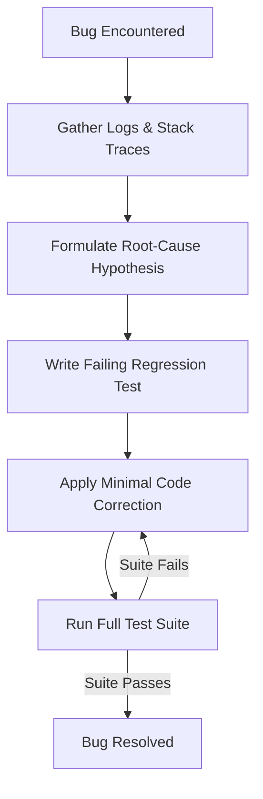

# Diagnose & Fix

## Overview
The "Diagnose & Fix" skill (often triggered via `/diagnose`) is a systematic debugging methodology for AI agents. Rather than guessing the source of an error and making random code modifications, the agent enters a structured loop: observing symptoms, gathering diagnostic data (logs, traces, test outputs), forming hypotheses, writing isolated regression tests, and applying minimal corrections.

## Prerequisites
- [Git Basics](git-basics.md) (Beginner) - For comparing diffs and reverting changes during debugging.
- [Test-Driven Development](test-driven-development.md) (Advanced) - For writing regression tests to prevent bug recurrence.

## Core Concepts
- **Diagnostic Loop**: A structured sequence of observation, hypothesis, testing, and fixing.
- **Regression Testing**: Writing a test that reproduces the bug, ensuring it is fixed and will not reappear in future changes.
- **Symptom Isolation**: Isolating the components or files responsible for the bug to minimize side effects during repair.

## In-Depth Guide
### The Diagnostic Loop Workflow
When debugging a bug or performance bottleneck, the agent executes the following steps:

1. **Information Gathering**:
   - Run compilation, build, or test suites to capture precise stack traces and error logs.
   - Trace path execution using debug statements or system utilities.
2. **Hypothesis Formation**:
   - Analyze the collected trace data to formulate hypotheses about the root cause.
3. **Regression Test Creation**:
   - Write a test that specifically targets and reproduces the buggy behavior. Ensure the test fails.
4. **Targeted Repair**:
   - Make the minimal necessary code modification to fix the bug and make the regression test pass.
5. **Verification**:
   - Run the entire project test suite to verify the fix works and has not introduced regressions.

## Verification
To verify this skill:
1. Introduce a deliberate bug into a module (e.g., throwing an unexpected error).
2. Trigger the `/diagnose` command on the failing component.
3. Confirm that the agent first identifies the error message and trace, writes a test confirming the failure, edits the file to correct the error, and runs the tests to confirm success.
