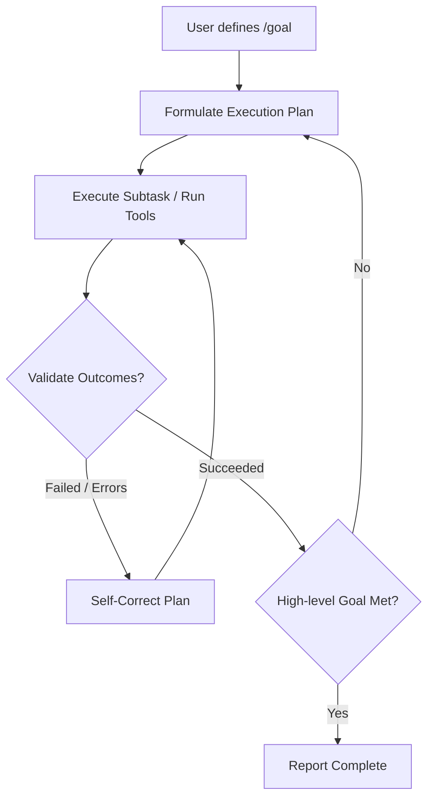

# Goal-Driven Execution

## Overview
Goal-Driven Execution (often triggered via `/goal` or autonomous background mode) allows an AI agent to run long-running tasks asynchronously. Instead of returning after a single tool execution or prompt turn, the agent runs in a continuous loop of planning, execution, verification, and adjustment. It does not stop until the high-level objective is fully achieved or determined to be impossible.

## Prerequisites
- [Git Basics](git-basics.md) (Beginner) - For tracking changes across autonomous sessions.
- [Prompt Engineering](prompt-engineering.md) (Intermediate) - For instructing subagents and specifying exit criteria.

## Core Concepts
- **Autonomous Agent Loop**: A cycle where the agent evaluates the current state against the goal, plans the next actions, executes them, and reassesses the state.
- **Asynchronous Execution**: Running tasks in the background, allowing the user to inspect status updates or work on other things.
- **Self-Correction & Recovery**: The ability of the agent to detect failures (e.g., compile errors, test failures, or API rate limits) and adapt its plan autonomously.
- **Thoroughness & Termination Criteria**: Defining precise conditions under which a goal is considered accomplished.

## In-Depth Guide
### The Goal-Driven Loop

### Key Practices for Background Execution
1. **Pacing and Notifications**: The agent should periodically save progress checkpoints and notify the user if major blocks or inputs are needed.
2. **Resource Management**: Avoid infinite loops by implementing max iteration caps or timeout limits on the background run.
3. **Robust Diagnostics**: When a command fails, read log files and run tests rather than guessing the failure mode.

## Verification
To verify this skill:
1. Invoke the `/goal` command with a complex, multi-step instruction (e.g., "Build a full-stack API and run tests in the background").
2. Verify that the agent spins off a background process and proceeds to execute multiple steps without halting for user interaction.
3. Verify that if a step fails, the agent reads the error log, modifies its code, and retries until success is reached.
