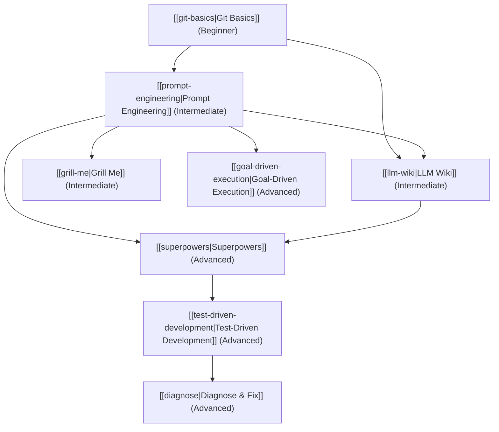

# Community Skills LLM-Wiki Index

Welcome to the **Community Skills Database**. This repository acts as a persistent, compounding LLM-Wiki, updated by crawler and compiler agents and audited by verification tools.

## Database Metrics
- **Total Skills: 8**
- **Last Ingestion Run**: 2026-05-24
- **Curator Agent**: Antigravity

---

## Skill Dependency Graph

The following diagram illustrates how skills in the database link together:

---

## Categorized Catalog

### Version Control
- [Git Basics](git-basics.md) - Learn how to track changes, commit progress, and collaborate in code bases.

### LLM Interactions
- [Prompt Engineering](prompt-engineering.md) - Techniques for structuring text prompts, using Chain-of-Thought, and enforcing schemas.

### Planning & Alignment
- [Grill Me](grill-me.md) - Socratic requirements gathering and stress-testing to avoid vibe coding.

### Knowledge & Memory
- [LLM Wiki](llm-wiki.md) - Maintaining persistent, structured codebase-level knowledge bases.

### Autonomous Workflows
- [Goal-Driven Execution](goal-driven-execution.md) - Managing background task loops, error correction, and goal achievement.

### Agentic Software Engineering
- [Superpowers](superpowers.md) - Structured multi-agent orchestration, planning, development, and review lifecycle.
- [Test-Driven Development](test-driven-development.md) - Strict red-green-refactor loops at the agent level.
- [Diagnose & Fix](diagnose.md) - Systematic debugging and regression testing procedures.

---

## How to Contribute
1. Place raw suggestions or community scraped skills in the `raw_inputs/` folder.
2. Ingest agents will read these inputs, determine if they represent a new skill or augmentations to an existing one, and write changes to `/skills`.
3. Run the validation tool to ensure the wiki's formatting and linking consistency is intact.
