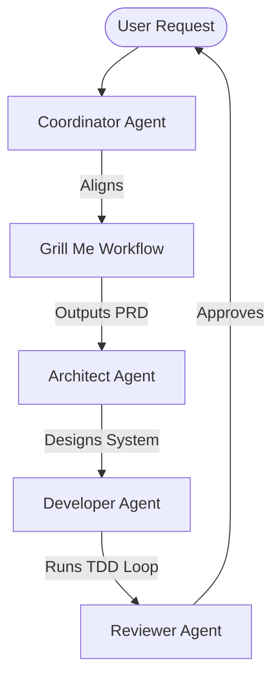

# Superpowers

## Overview
"Superpowers" is a comprehensive AI-assisted software development framework and methodology (historically popularized via projects like `obra/superpowers`). It shifts AI interactions from simple autocomplete or "vibe coding" into a disciplined software engineering process. It accomplishes this by defining formal roles, state-driven workflows, testing cycles, and subagent orchestration protocols.

## Prerequisites
- [Prompt Engineering](prompt-engineering.md) (Intermediate) - For instructing subagents and specifying constraints.
- [LLM Wiki](llm-wiki.md) (Intermediate) - For maintaining persistent context during long development cycles.

## Core Concepts
- **Subagent Orchestration**: Breaking down a complex engineering project into tasks performed by specialized subagents (e.g., Architect, Developer, Reviewer).
- **Test-Driven Development (TDD) Loop**: Writing tests before implementation code and iterating until they pass.
- **Strict Guardrails**: Restricting the agent's operations (e.g., stopping git commits to production, requiring human sign-off on destructive commands).
- **Phase-Based Progress**: Progressing sequentially through Ideation, Planning, Implementation, Review, and Deployment.

## In-Depth Guide
### The Superpowers Lifecycle
1. **Brainstorming & Alignment**:
   - Align requirements using [Grill Me](grill-me.md).
   - Document domain vocabularies and constraints.
2. **Architecture & Design**:
   - The Architect subagent reviews the codebase and outputs a detailed implementation plan.
   - Define interfaces and stable "deep modules" before writing logic.
3. **Execution (TDD)**:
   - The Developer subagent writes failing tests first.
   - Implement the minimum code to pass the tests.
   - Refactor codebase with verification.
4. **Review & Audit**:
   - The Reviewer subagent validates code quality, security flaws, and performance.
   - Run verification tools.

### Orchestration Model
Below is a typical multi-agent collaboration model within Superpowers:

## Verification
To verify this skill:
1. Initialize a multi-agent workflow where a Coordinator spawns an Architect subagent to generate a design plan.
2. Verify that the implementation subagent writes and executes a test before writing the application code.
3. Confirm that a separate Reviewer subagent catches style or verification errors before declaring the task done.
