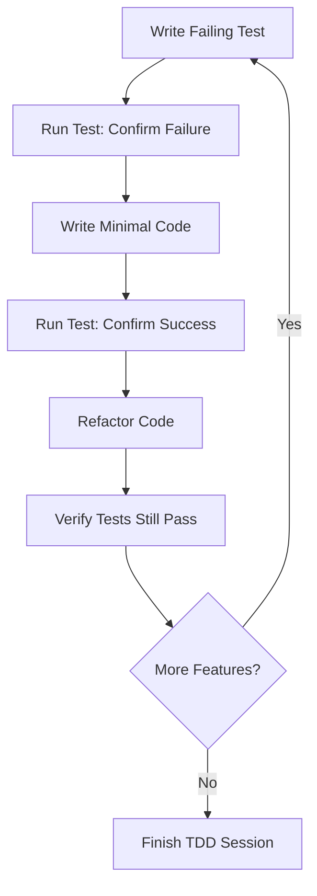

# Test-Driven Development (TDD)

## Overview
Test-Driven Development (often triggered via `/tdd` in agent toolkits) is a development methodology that forces the AI agent to write automated tests before implementing functional code. By establishing test expectations upfront, the agent ensures that all logic is verifiable, avoiding scope creep and producing clean, self-documenting code.

## Prerequisites
- [Git Basics](git-basics.md) (Beginner) - For managing commits during test/implementation cycles.
- [Superpowers](superpowers.md) (Advanced) - TDD is a core building block of the Superpowers methodology.

## Core Concepts
- **Red-Green-Refactor Loop**: 
  1. **Red**: Write a failing test that defines the desired behavior.
  2. **Green**: Write the minimal codebase implementation to make the test pass.
  3. **Refactor**: Clean up the code (remove duplication, improve design) while ensuring the test stays green.
- **Vertical Slice Development**: Implementing one small, end-to-end behavior at a time, rather than writing a huge batch of untested code.
- **Behavior Specification**: Using tests as the primary specification of what the system does.

## In-Depth Guide
### The Red-Green-Refactor Workflow
For an AI agent, a strict TDD loop follows these steps:

1. **Test Creation (Red)**:
   - Identify the single next feature or capability to add.
   - Write a unit or integration test in the test suite.
   - Run the test suite and confirm that the new test **fails** (Red).
2. **Minimal Implementation (Green)**:
   - Write the simplest code necessary to make the test pass.
   - Do not add extra features or optimize yet.
   - Run the test suite and confirm all tests **pass** (Green).
3. **Design Refinement (Refactor)**:
   - Clean up code formatting, names, and structure.
   - Run the tests again after each refactoring change to ensure no regressions occurred.

## Verification
To verify this skill:
1. Trigger `/tdd` for a simple feature (e.g., "Implement a function that reverses strings").
2. Confirm that the agent first writes a test file containing assertions for reversing strings.
3. Confirm that the agent executes the test suite and observes the failure.
4. Verify that the agent then writes the function implementation and executes the tests again to verify success.
