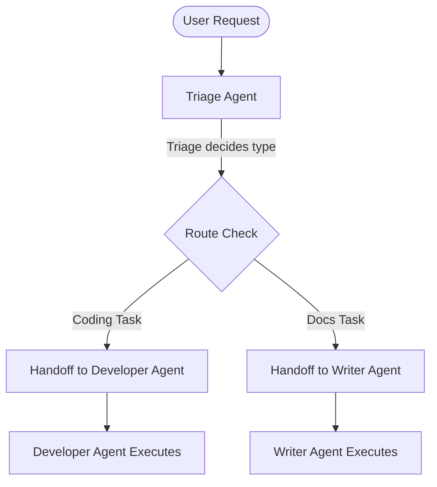

# Agent Hand-offs

## Overview
"Agent Hand-offs" is a design pattern (often associated with lightweight frameworks like OpenAI Swarm) for coordinating multi-agent systems where agents route execution dynamically by returning another agent instance. This approach eliminates the need for central state-orchestrators by allowing specialized agents to transfer control directly.

## Prerequisites
- [Prompt Engineering](prompt-engineering.md) (Intermediate) - Formulating clear system instructions that define the domain of each agent and routing conditions.

## Core Concepts
- **Triage Agent**: The entry point agent that analyzes the user's initial input and routes the execution to the appropriate domain expert.
- **Hand-off Function**: A function or tool that, when executed, returns a new agent instance along with the accumulated conversation history.
- **Context Delegation**: Passing down state, execution tokens, and variables to the next agent.
- **State Handovers**: Seamless transfers without resetting conversation history, ensuring the target agent has full context.

## In-Depth Guide

### Routing Lifecycle
Below is a typical multi-agent hand-off flow where a query is analyzed and routed:



### Typical Code Structure (Python)
An agent returns another agent from a tool call to hand off the conversation:

```python
def handoff_to_developer_agent():
    """Handoff the conversation to the developer agent who handles implementation."""
    return developer_agent

def handoff_to_writer_agent():
    """Handoff the conversation to the technical writer agent who handles documentation."""
    return writer_agent
```

## Verification
To verify this skill:
1. Initialize a multi-agent environment with a Triage Agent.
2. Ask the triage agent a domain-specific question (e.g. "Draft a technical specification document").
3. Confirm that the Triage Agent calls the hand-off tool for the Writer Agent.
4. Verify that the conversation state is passed along and the Writer Agent completes the task.
