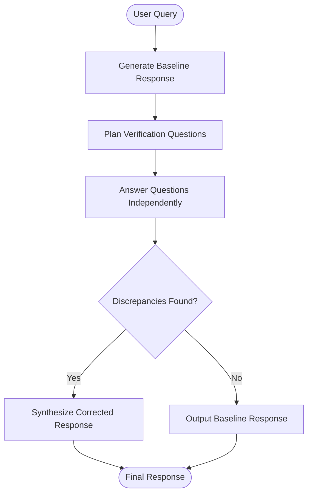

# Chain of Verification (CoVe)

## Overview
Chain of Verification (CoVe) is a prompting and reasoning pattern designed to minimize LLM hallucinations. The workflow consists of four steps: generating an initial baseline response, planning independent verification questions to test the facts in that response, answering those verification questions objectively without bias from the initial response, and synthesizing a corrected final output that incorporates the verified facts.

## Prerequisites
- [Prompt Chaining](prompt-chaining.md) (Intermediate) - For linking baseline generation, question formulation, answering, and synthesis.
- [Reason and Act](reason-and-act.md) (Intermediate) - For executing verification steps.

## Core Concepts
- **Baseline Response**: The initial generation, which may contain factual inaccuracies.
- **Verification Planning**: Formulating specific, answerable questions that probe the assumptions/facts in the baseline.
- **Independent Answering**: Answering verification questions individually (often via a separate LLM call or context) to prevent confirmation bias.
- **Synthesis**: Reviewing the answers to correct any discrepancies in the baseline response.

## In-Depth Guide

### Workflow Loop
The execution path of a Chain of Verification system is illustrated below:

### Answering Phase
Formulating questions that do not lead the model:
- **Leading**: "Why did X happen?" (Assumes X happened)
- **Independent**: "Did X happen? If so, when and why?"

## Verification
To verify this skill:
1. Query the agent with a prompt prone to hallucinations (e.g. "Name 5 movies directed by Quentin Tarantino that won the Palme d'Or").
2. Verify that the agent generates a baseline response, extracts claims (e.g., "Pulp Fiction won", "Kill Bill won"), and drafts verification questions.
3. Verify that the agent answers the verification questions (discovering that Kill Bill did not win the Palme d'Or) and outputs a corrected list containing only the verified entries.
