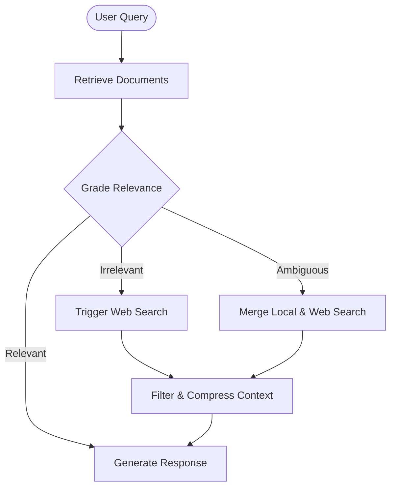

# Corrective RAG

## Overview
Corrective Retrieval-Augmented Generation (CRAG) is an agentic workflow that addresses retrieval inaccuracies in standard RAG systems. It introduces a self-grading/evaluation step: if retrieved documents are graded as irrelevant, the agent triggers external search engines or web crawlers to fetch the correct data and filters out noise before generation.

## Prerequisites
- [LLM Wiki](llm-wiki.md) (Intermediate) - For searching document vaults and local knowledge bases.
- [Prompt Engineering](prompt-engineering.md) (Intermediate) - For designing reliable LLM-based graders and evaluators.

## Core Concepts
- **Document Grader/Evaluator**: A classification step where the agent judges the relevance of retrieved documents to the query.
- **Fallbacks & Fall-forward**: Branching paths based on grading results (e.g., local RAG only, web-search fallback, or hybrid).
- **Web Search Ingestion**: Triggering external search APIs or web scraping when local context is insufficient.
- **Context Compression**: Extracting only the relevant sentences or entities from retrieved text to minimize context noise.

## In-Depth Guide

### Workflow Loop
The execution path for a CRAG system is illustrated below:



### Grader Design Pattern
A binary classifier prompt determines relevance:
```markdown
You are an evaluator. Grade the relevance of the retrieved document to the user query.
Return JSON: {"relevance": "yes" | "no" | "partial"}
Query: {user_query}
Document: {retrieved_doc}
```

## Verification
To verify this skill:
1. Provide a query on a topic not present in the local vector store (e.g. "latest tech release from today").
2. Confirm the agent retrieves local documents, grades them as irrelevant, and falls back to a web search.
3. Verify that the agent successfully filters out web noise and synthesizes the correct answer.
