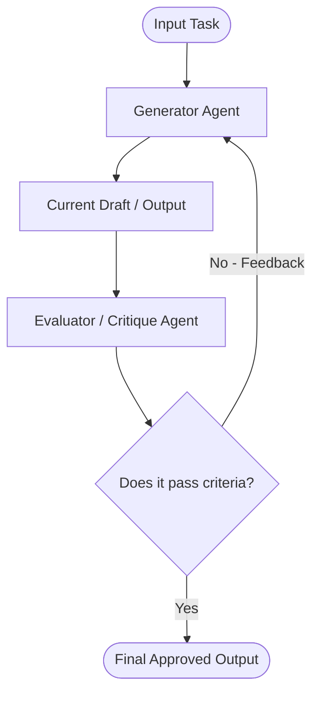

# Evaluator-Optimizer

## Overview
"Evaluator-Optimizer" is an iterative design pattern where a generator agent produces an initial output and an evaluator agent critiques the output against defined criteria, driving a feedback loop that refines the output until it meets quality standards.

## Prerequisites
- [Prompt Engineering](prompt-engineering.md) (Intermediate) - Defining objective evaluation criteria.

## Core Concepts
- **Generator**: The agent responsible for drafting the solution or content.
- **Evaluator**: A separate agent or validation function that reviews the generator's output and provides structured feedback or scores.
- **Feedback Loop**: The iterative cycle of generate-critique-optimize.
- **Threshold / Exit Condition**: A definition of success (e.g., test coverage, passing rubric, or max iterations) that terminates the loop.

## In-Depth Guide

### The Evaluator-Optimizer Loop
The feedback and refinement loop runs until quality criteria are satisfied:

### When to Use
- **Clear Evaluation Rubric**: When you can define exactly what a good output looks like (e.g., code correctness, translation accuracy, compliance guidelines).
- **Iterative Improvement**: When first-pass outputs from LLMs typically require corrections or polish.

## Verification
To verify this skill:
1. Provide a draft text or code snippet with intentional flaws.
2. Verify that the Evaluator detects the flaws, provides actionable critique, and the Generator uses it to deliver a corrected version.
