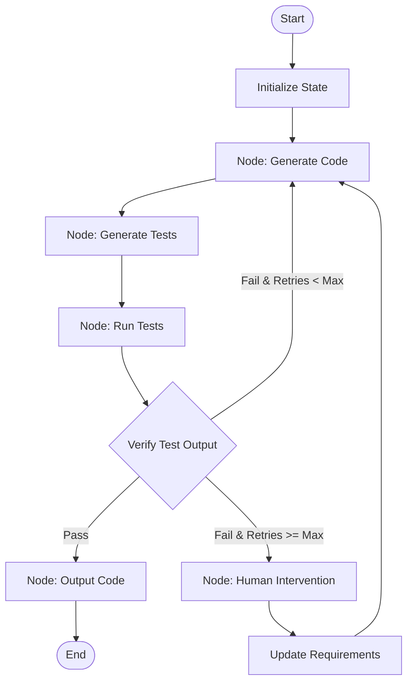

# Flow Engineering

## Overview
Flow Engineering is an architectural pattern that structures agent workflows as deterministic state machines or directed graphs rather than leaving reasoning paths entirely to the LLM's autonomy (like ReAct). By explicitly defining execution nodes, routing edges, and shared state, Flow Engineering increases the predictability, debugging capability, and reliability of complex agent systems.

## Prerequisites
- [Prompt Engineering](prompt-engineering.md) (Intermediate) - For writing reliable structured outputs that drive conditional routing decisions.
- [Prompt Chaining](prompt-chaining.md) (Intermediate) - To understand sequential data flows.
- [Parallelization](parallelization.md) (Intermediate) - For executing multiple nodes concurrently.

## Core Concepts
- **State Graph**: A directed graph where nodes represent computational steps (LLM calls, tool usage, human feedback) and edges represent execution flows.
- **Shared State**: A central, thread-safe memory object (or dictionary) passed between nodes, updated incrementally by each step.
- **Conditional Routing**: Deciding the next node based on LLM outputs or programmatic checks on the current state.
- **Human-in-the-Loop Interruption**: Pausing graph execution at specific state-machine checkpoints to wait for human verification before proceeding.
- **Loops & Backtracking**: Rerouting execution back to earlier nodes (e.g., repeating code generation if validation tests fail).

## In-Depth Guide

### Workflow Loop
An example Flow Engineering state machine structure (e.g., Code Gen with test loop) is diagrammed below:



### Conditional Router Pattern
Conditional routing can be implemented via a function mapping current state values to the next node name:
```python
def route_next_node(state: dict) -> str:
    if state["test_failures"] > 0:
        if state["retries"] < 3:
            return "generate_code"
        else:
            return "human_intervention"
    return "finalize_output"
```

## Verification
To verify this skill:
1. Initialize a workflow graph with a mock error rate on a node.
2. Verify that the agent follows the conditional transition rules, incrementing retry counters in the shared state and returning to the generator node.
3. Confirm that when retry limits are reached, the state machine successfully interrupts and prompts for human feedback.
