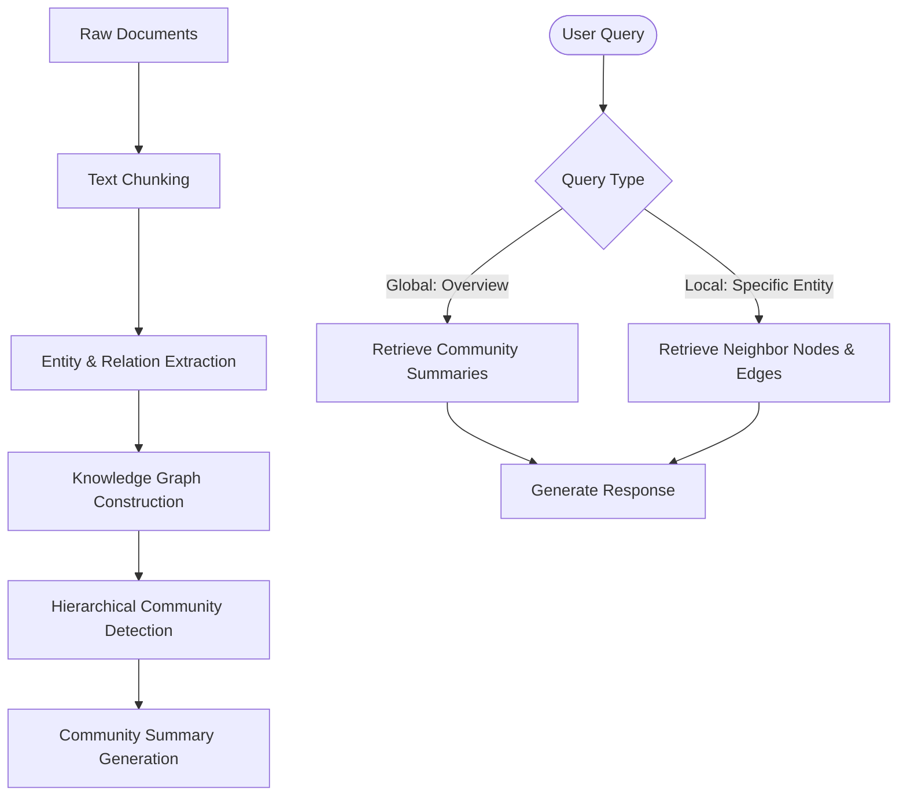

# GraphRAG

## Overview
GraphRAG (Graph-based Retrieval-Augmented Generation) is an advanced retrieval pattern that integrates Knowledge Graphs into the RAG pipeline. Instead of relying solely on vector similarity over disconnected text chunks, GraphRAG structures source data as a network of nodes (entities) and edges (relationships). This allows the agent to reason across multiple documents, perform "multi-hop" query answering, and produce comprehensive global summaries of large, complex datasets.

## Prerequisites
- [LLM Wiki](llm-wiki.md) (Intermediate) - For understanding document stores and contextual grounding.
- [Prompt Engineering](prompt-engineering.md) (Intermediate) - For extracting entity-relation triplets from text chunks.

## Core Concepts
- **Entity Extraction**: Identifying key concepts, people, locations, or topics (nodes) and their descriptions in source texts.
- **Relationship Extraction**: Mapping connections (edges) and descriptions of how extracted entities interact.
- **Hierarchical Clustering**: Using community detection algorithms (e.g., Leiden) to group related entities into hierarchical themes or "communities."
- **Global Summarization**: Pre-generating summaries of these entity communities to enable fast top-down summarization of the entire database.
- **Multi-Hop Retrieval**: Traversing graph paths to answer queries requiring information scattered across multiple documents.

## In-Depth Guide

### Workflow Loop
The typical GraphRAG execution path is structured as follows:



### Triplet Extraction Example Prompt
To construct the graph, agents extract relationships from chunks using structured instructions:
```markdown
Identify all key entities and their relationships in the text below.
Output a JSON list of triplets:
[
  {
    "source": "Entity A",
    "target": "Entity B",
    "relation": "describes relationship",
    "description": "supporting details from text"
  }
]
Text: {text_chunk}
```

## Verification
To verify this skill:
1. Provide a document corpus consisting of multiple separate files where Entity A is linked to Entity B in File 1, and Entity B is linked to Entity C in File 2.
2. Ask the agent a multi-hop question: "How does Entity A relate to Entity C?"
3. Confirm that the agent retrieves paths connecting Entity A to Entity C via Entity B and synthesizes a coherent explanation.
4. Verify that standard vector RAG fails or provides incomplete context because the text chunks are disconnected in vector space.
