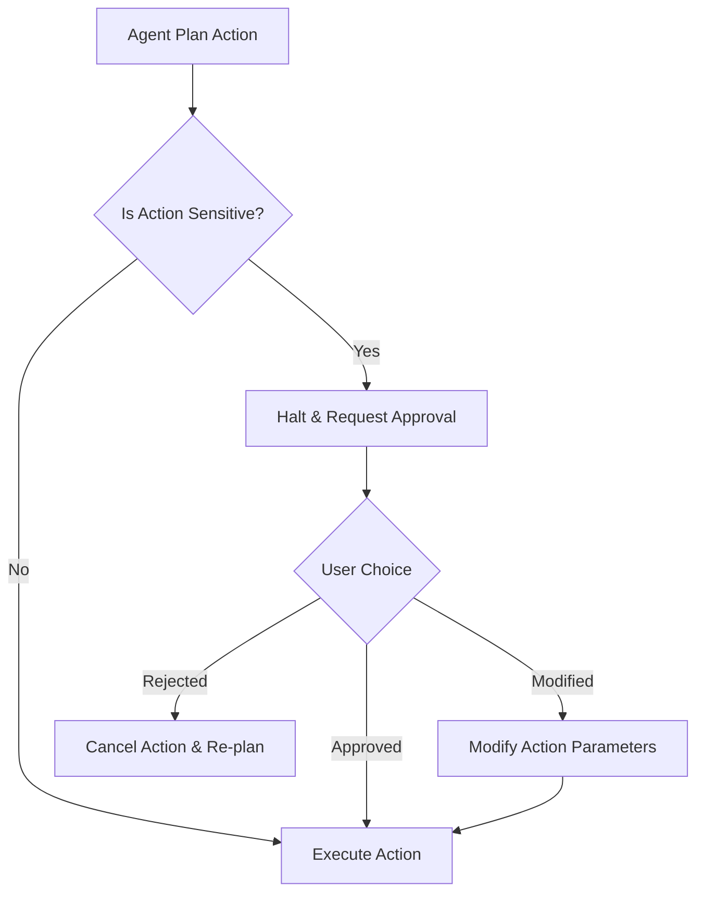

# Human-in-the-Loop

## Overview
"Human-in-the-Loop" (HITL) is an agentic workflow orchestration pattern that builds explicit checkpoints requiring human review, authorization, or guidance before executing high-risk operations. This ensures security, reduces hallucination risks, and maintains alignment with user intent during autonomous processes.

## Prerequisites
- [Grill Me](grill-me.md) (Intermediate) - For conducting initial requirements gathering and structuring alignment interfaces.

## Core Concepts
- **Interruption Gate**: A step in the execution graph where the agent halts automatically and awaits external input.
- **Sensitive Operations**: Actions classified as risky (e.g. executing bash commands, writing to databases, deploying to production, or modifying file structures).
- **Interactive State Modification**: Providing interfaces for the user to edit proposed commands, text drafts, or file contents during a pause.
- **State Serialization**: Saving agent state so it can resume exactly where it was interrupted after approval.

## In-Depth Guide

### HITL Lifecycle Flow
Below is a typical interaction flow for a Human-in-the-Loop gate:



### Implementing HITL Prompts
When designing HITL agents, the agent must output a structured block outlining what it wants to execute:
```markdown
[ACTION REQUIRED]
The agent wishes to run the following bash command:
`rm -rf ./build`
Reason: Clean up build artifacts before recompiling.

Please approve, modify, or cancel this action.
```

## Verification
To verify this skill:
1. Trigger a process that includes terminal command execution.
2. Confirm the agent pauses, prints the exact command, and prompts for your approval.
3. Deny the command or request a modification.
4. Verify the agent honors the feedback, changes its plan, and does not execute the original command.
