# Community Skills LLM-Wiki Index

Welcome to the **Community Skills Database**. This repository acts as a persistent, compounding LLM-Wiki, updated by crawler and compiler agents and audited by verification tools.

## Database Metrics
- **Total Skills: 33**
- **Last Ingestion Run**: 2026-06-02
- **Curator Agent**: Antigravity

---

## Skill Dependency Graph

The following diagram illustrates how skills in the database link together:

```mermaid
graph TD
    gb["[[git-basics|Git Basics]] (Beginner)"] --> pe["[[prompt-engineering|Prompt Engineering]] (Intermediate)"]
    gb --> lw["[[llm-wiki|LLM Wiki]] (Intermediate)"]
    pe --> lw
    pe --> gm["[[grill-me|Grill Me]] (Intermediate)"]
    pe --> sp["[[superpowers|Superpowers]] (Advanced)"]
    pe --> gd["[[goal-driven-execution|Goal-Driven Execution]] (Advanced)"]
    lw --> sp
    sp --> td["[[test-driven-development|Test-Driven Development]] (Advanced)"]
    td --> df["[[diagnose|Diagnose & Fix]] (Advanced)"]
    pe --> mcp["[[model-context-protocol|Model Context Protocol]] (Intermediate)"]
    mcp --> gd
    pe --> ah["[[agent-hand-offs|Agent Hand-offs]] (Intermediate)"]
    ah --> sp
    lw --> cr["[[corrective-rag|Corrective RAG]] (Advanced)"]
    gm --> hi["[[human-in-the-loop|Human-in-the-Loop]] (Intermediate)"]
    hi --> gd
    pe --> ra["[[reason-and-act|Reason and Act]] (Intermediate)"]
    ra --> gd
    pe --> rt["[[routing|Routing]] (Intermediate)"]
    rt --> ah
    pe --> pc["[[prompt-chaining|Prompt Chaining]] (Intermediate)"]
    pe --> pl["[[parallelization|Parallelization]] (Intermediate)"]
    pc --> ow
    pl --> ow
    pe --> ow["[[orchestrator-workers|Orchestrator-Workers]] (Advanced)"]
    ow --> sp
    pe --> eo["[[evaluator-optimizer|Evaluator-Optimizer]] (Advanced)"]
    eo --> td
    lw --> mc["[[memory-consolidation|Memory Consolidation]] (Advanced)"]
    mc --> gd
    ah --> so["[[swarm-orchestration|Swarm Orchestration]] (Advanced)"]
    rt --> so
    so --> sp
    pe --> pae["[[plan-and-execute|Plan-and-Execute]] (Advanced)"]
    pae --> gd
    pe --> tm["[[tool-maker|Tool Maker]] (Advanced)"]
    mcp --> tm
    td --> tm
    tm --> sp
    pe --> piv["[[piv-loop|PIV Loop]] (Advanced)"]
    lw --> piv
    td --> piv
    piv --> gd
    pe --> mad["[[multi-agent-debate|Multi-Agent Debate]] (Advanced)"]
    ah --> mad
    eo --> mad
    mad --> sp
    pe --> rx["[[reflexion|Reflexion]] (Advanced)"]
    eo --> rx
    rx --> gd
    pe --> tot["[[tree-of-thoughts|Tree of Thoughts]] (Advanced)"]
    pl --> tot
    tot --> gd
    pe --> sd["[[self-discovery|Self-Discovery]] (Advanced)"]
    sd --> pae
    lw --> gr["[[graph-rag|GraphRAG]] (Advanced)"]
    gr --> gd
    pe --> fe["[[flow-engineering|Flow Engineering]] (Intermediate)"]
    pc --> fe
    pl --> fe
    fe --> ow
    fe --> gd
    lw --> vcm["[[virtual-context-management|Virtual Context Management]] (Advanced)"]
    mc --> vcm
    vcm --> gd
    pl --> moa["[[mixture-of-agents|Mixture of Agents]] (Advanced)"]
    ow --> moa
    mad --> moa
    moa --> sp
    cr --> srag["[[self-rag|Self-RAG]] (Advanced)"]
    rx --> srag
    srag --> gd
    pc --> cove["[[chain-of-verification|Chain of Verification]] (Advanced)"]
    ra --> cove
    cove --> gd
```

---

## Categorized Catalog

### Version Control
- [Git Basics](git-basics.md) - Learn how to track changes, commit progress, and collaborate in code bases.

### LLM Interactions
- [Prompt Engineering](prompt-engineering.md) - Techniques for structuring text prompts, using Chain-of-Thought, and enforcing schemas.
- [Prompt Chaining](prompt-chaining.md) - Sequentially link multiple LLM calls where the output of one step becomes the input for the next, with programmatic checks.
- [Parallelization](parallelization.md) - Execute multiple LLM calls concurrently, using sectioning for partitioning or voting for consensus, then aggregate results.
- [Model Context Protocol](model-context-protocol.md) - Standardized client-server framework for LLMs to securely query resources, prompts, and tools.
- [Reason and Act](reason-and-act.md) - Reusable execution loop alternating between reasoning (Thought) and tool execution (Action / Observation).
- [Tool Maker](tool-maker.md) - Autonomously create, debug, test, and register custom code tools to solve specific recurring tasks and reuse them to save token costs and improve accuracy.
- [Tree of Thoughts](tree-of-thoughts.md) - Search and evaluate multiple alternative reasoning paths to solve complex, multi-step planning or logic tasks.
- [Chain of Verification](chain-of-verification.md) - Reduce hallucinations by generating a baseline response, drafting verification questions, answering them independently, and synthesizing a corrected output.

### Planning & Alignment
- [Grill Me](grill-me.md) - Socratic requirements gathering and stress-testing to avoid vibe coding.
- [Human-in-the-Loop](human-in-the-loop.md) - Orchestration pattern requiring explicit human verification or modification for critical actions.
- [Plan-and-Execute](plan-and-execute.md) - Decouple planning from execution by generating a step-by-step plan first, executing each step sequentially, and dynamically re-planning if errors occur.
- [Self-Discovery](self-discovery.md) - Autonomously select, adapt, and compose custom reasoning modules to form a tailored cognitive plan for complex tasks.

### Knowledge & Memory
- [LLM Wiki](llm-wiki.md) - Maintaining persistent, structured codebase-level knowledge bases.
- [Corrective RAG](corrective-rag.md) - RAG workflow with self-evaluation, web search fallback, and context filtering.
- [GraphRAG](graph-rag.md) - Uses a structured knowledge graph to map entities and relationships from data, enabling multi-hop reasoning and global context summaries over large document collections.
- [Memory Consolidation](memory-consolidation.md) - Distilling episodic traces into structured, persistent long-term knowledge to prevent prompt bloat.
- [Virtual Context Management](virtual-context-management.md) - Manages LLM context constraints by treating the immediate context window as RAM and using external databases as disk storage (archival/episodic memory), allowing agents to swap/page memory in and out.
- [Self-Reflective Retrieval-Augmented Generation](self-rag.md) - Self-Reflective Retrieval-Augmented Generation (Self-RAG) pattern integrating self-critique of retrieved context relevance, output grounding, and utility.

### Autonomous Workflows
- [Goal-Driven Execution](goal-driven-execution.md) - Managing background task loops, error correction, and goal achievement.
- [Agent Hand-offs](agent-hand-offs.md) - Lightweight multi-agent coordination pattern where agents transfer execution control dynamically.
- [Routing](routing.md) - Classification-based redirection of tasks to specialized prompts, models, or sub-agents.
- [Orchestrator-Workers](orchestrator-workers.md) - Supervisor agent decomposing tasks and coordinating specialized worker agents.
- [Evaluator-Optimizer](evaluator-optimizer.md) - Iterative refinement loop with a generator producing outputs and an evaluator critiquing them.
- [Swarm Orchestration](swarm-orchestration.md) - Decentralized multi-agent collaboration pattern with dynamic agent hand-offs and execution flow.
- [Multi-Agent Debate](multi-agent-debate.md) - Structured multi-turn debate among peer agents with distinct perspectives to refine reasoning and reach consensus.
- [Reflexion](reflexion.md) - Execute the Reflexion loop to iteratively refine agent outputs using self-critique and persistent failure memory.
- [Flow Engineering](flow-engineering.md) - Structuring agent logic as deterministic state graphs/machines with explicit transitions and routing to control agent autonomy and ensure reliability.
- [Mixture of Agents](mixture-of-agents.md) - Layered multi-agent pattern that runs multiple LLM calls in parallel and aggregates their outputs across sequential steps to improve response quality.

### Agentic Software Engineering
- [Superpowers](superpowers.md) - Structured multi-agent orchestration, planning, development, and review lifecycle.
- [Test-Driven Development](test-driven-development.md) - Strict red-green-refactor loops at the agent level.
- [Diagnose & Fix](diagnose.md) - Systematic debugging and regression testing procedures.
- [Plan-Implement-Validate Loop (PIV Loop)](piv-loop.md) - Structured coding workflow dividing development into distinct planning, context-clearing implementation, and validation phases.

---

## How to Contribute
1. Place raw suggestions or community scraped skills in the `raw_inputs/` folder.
2. Ingest agents will read these inputs, determine if they represent a new skill or augmentations to an existing one, and write changes to `/wiki` and `/skills`.
3. Run the validation tool to ensure the wiki's formatting and linking consistency is intact.

