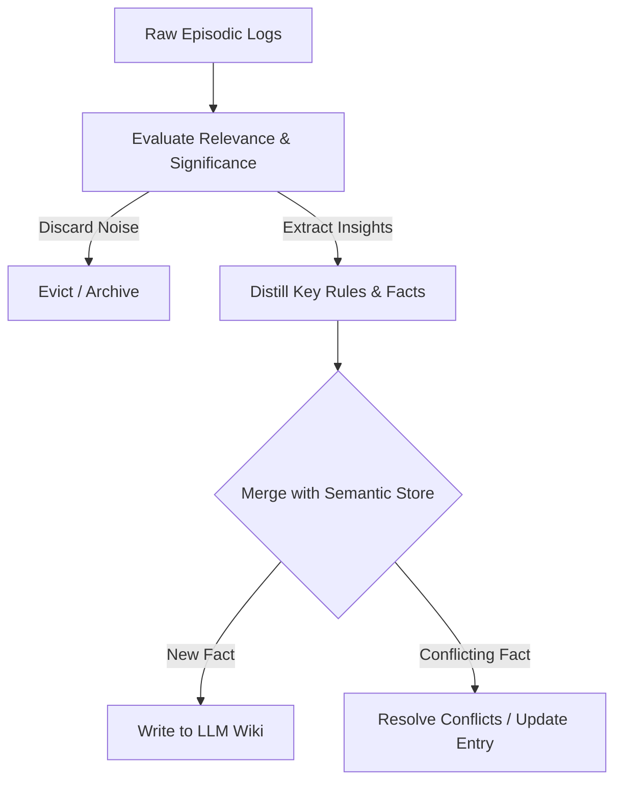

# Memory Consolidation

## Overview
Memory Consolidation is the process of extracting, distilling, and converting short-term episodic traces (raw transcripts, command history, execution logs, and user feedback) into persistent, structured long-term semantic knowledge. This pattern mitigates context window bloat, reduces LLM inference costs, and reinforces successful problem-solving pathways by ensuring the agent remembers critical lessons and insights across distinct session executions.

## Prerequisites
- [LLM Wiki](llm-wiki.md) (Intermediate) - To store consolidated memories.
- [Prompt Engineering](prompt-engineering.md) (Intermediate) - For instructing distillation steps.

## Core Concepts
- **Episodic Memory**: A time-indexed trace of specific, raw experiences (e.g., "Step 5: Ran git commit, failed due to detached HEAD").
- **Semantic Memory**: Distilled, generalized rules and facts (e.g., "When running in detached HEAD, checkout branch first").
- **Distillation/Compaction**: Running background summarization loops to compress logs into structured knowledge.
- **Eviction & Decay**: Deleting or archiving low-priority or outdated episodic memories to maintain active context efficiency.

## In-Depth Guide

### The Consolidation Cycle
Memory consolidation operates as a background or post-execution optimization cycle:

### Memory Distillation Blueprint
When consolidating memory, agents should follow a systematic template:
1. **Analyze**: Extract the core objective, successful actions, and error recovery steps.
2. **De-duplicate**: Check if a similar lesson or rule already exists in the LLM Wiki.
3. **Format**: Draft a concise rule containing the context, the problem, and the verified resolution.
4. **Prune**: Delete raw, high-volume log streams from the working memory context.

## Verification
To verify this skill:
1. Execute a complex debugging task with multiple failed attempts and an eventual fix.
2. Verify that the agent compiles an execution summary extracting the root cause and successful resolution.
3. Confirm that the agent updates the LLM Wiki with the distilled rule and clean-deletes the raw debug output files.
