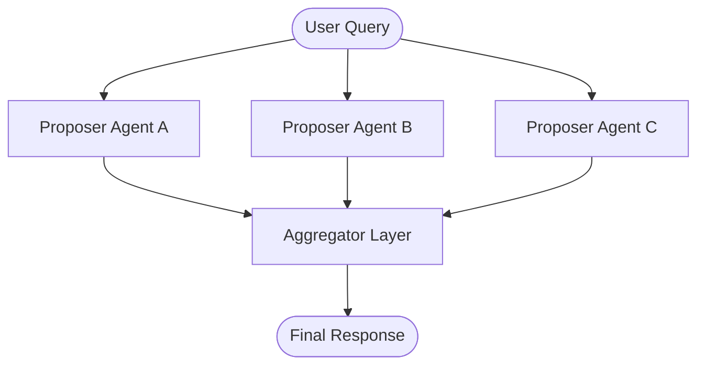

# Mixture of Agents

## Overview
Mixture of Agents (MoA) is a collaborative multi-agent architecture where multiple LLM models (agents) generate answers in parallel layers, and their responses are iteratively aggregated and refined by subsequent layers of agents. This layered structure leverages the diverse capabilities of different models—such as specialized domain expertise or reasoning styles—to produce a final consensus response that often surpasses the quality of any single model operating alone.

## Prerequisites
- [Parallelization](parallelization.md) (Intermediate) - For running multiple agents in parallel.
- [Orchestrator-Workers](orchestrator-workers.md) (Advanced) - For structuring hierarchical task delegation.
- [Multi-Agent Debate](multi-agent-debate.md) (Advanced) - For understanding model consensus.

## Core Concepts
- **Layered Architecture**: Similar to feed-forward networks, agents are divided into sequential layers.
- **Proposers (Worker Agents)**: Early-layer models that generate draft responses or perspective-specific inputs based on the original query.
- **Aggregators (Synthesizers)**: Later-layer models that take outputs from the previous layer as context, synthesizing and improving the response.
- **Model Diversity**: Combining different LLMs (e.g., Llama, Mistral, Gemini, Claude) to balance cost, speed, and analytical depth.

## In-Depth Guide

### Workflow Loop
The execution flow of a Mixture of Agents architecture is illustrated below:



### Prompt Engineering for Aggregators
An aggregator agent must reconcile conflicting information and extract the best insights:
```markdown
You are an expert aggregator. You are given a query and a set of candidate responses generated by different AI assistants.
1. Compare and contrast the draft responses.
2. Identify any factual inaccuracies, contradictions, or gaps.
3. Synthesize a unified, comprehensive, and accurate response based on the best parts of the drafts.

Query: {user_query}
Candidate Responses:
- Assistant 1: {response_1}
- Assistant 2: {response_2}
- Assistant 3: {response_3}
```

## Verification
To verify this skill:
1. Provide a complex query (e.g., "Summarize the pros/cons of three distinct approaches to implementing distributed state in serverless environments").
2. Run proposer agents in parallel and verify that different drafts are generated.
3. Pass all drafts to the aggregator agent and verify that the final output synthesizes all perspectives, removes redundancy, and presents a cohesive, high-quality summary.
