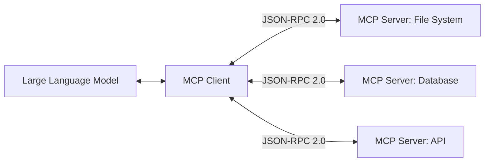

# Model Context Protocol

## Overview
The Model Context Protocol (MCP) is an open standard that enables AI models to connect securely and seamlessly to external context sources, developer tools, and databases. Developed to prevent fragmentation in LLM integrations, it decouples the application (client) from the tools and data providers (servers) via a standardized JSON-RPC 2.0 protocol.

## Prerequisites
- [Prompt Engineering](prompt-engineering.md) (Intermediate) - For formulating queries and matching input parameters to tool schemas.

## Core Concepts
- **MCP Client**: The application or agent runtime that coordinates with the LLM and routes requests to the appropriate servers.
- **MCP Server**: Lightweight, modular services that expose resources, prompts, and tools to the client.
- **Resources**: Read-only data sources (e.g., local files, database tables, API documentation) exposed by the server.
- **Prompts**: Standardized templates that compile user intent into structured instructions for the LLM.
- **Tools**: Executable functions (e.g., running terminal commands, editing files, making web requests) that the LLM can invoke.

## In-Depth Guide

### Architecture Flow
The communication model is structured as follows:



### Implementing Client Integration
1. **Initialize Connection**: Establish standard input/output (stdio) streams or WebSocket transport to connect client and server.
2. **Retrieve Schema**: Query `/tools`, `/resources`, or `/prompts` endpoints to understand capabilities.
3. **Execute Actions**: Detect LLM tool requests, translate them to MCP tool calls, and execute them on the target server.

### Example Server Configuration (`mcpConfig.json`)
```json
{
  "mcpServers": {
    "git-server": {
      "command": "node",
      "args": ["/path/to/git-mcp/index.js"],
      "env": {
        "GIT_REPO_PATH": "/path/to/repo"
      }
    }
  }
}
```

## Verification
To verify this skill:
1. Query an MCP server using a discovery API (e.g. `list_resources` or `list_tools`).
2. Verify that the response returns the schema definitions for available tools or resources.
3. Call an available tool (e.g., executing a dummy query) and confirm that the execution completes successfully and returns formatted results.
