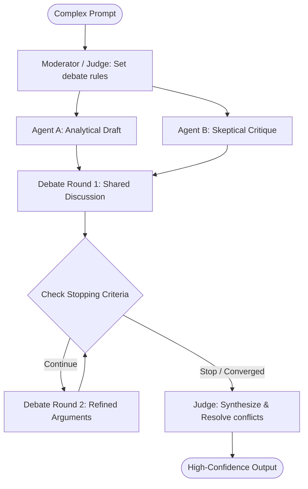

# Multi-Agent Debate

## Overview
Multi-Agent Debate (MAD) is an agentic coordination pattern where multiple LLM agents with distinct personas, goals, or viewpoints discuss and critique each other's outputs in a structured, multi-turn dialogue. The goal is to reach a consensus, improve factual correctness, reduce sycophancy, and filter out reasoning errors. It is highly effective for complex, high-stakes tasks like diagnostics, investment analysis, code auditing, and strategic planning.

## Prerequisites
- [Prompt Engineering](prompt-engineering.md) (Intermediate) - Crafting distinct agent personas and debate rules.
- [Agent Hand-offs](agent-hand-offs.md) (Intermediate) - Transitioning turn-taking between different agents.
- [Evaluator-Optimizer](evaluator-optimizer.md) (Advanced) - Utilizing critique loops to refine outputs.

## Core Concepts
- **Agent Personas**: Equipping debate participants with specialized perspectives (e.g., the optimist, the pessimist, the security auditor, the performance specialist) to avoid homogeneous thinking.
- **Sycophancy Filtering**: Preventing the tendency of single LLMs to agree with the user's prompt by forcing distinct agents to argue opposing sides.
- **Moderator/Judge**: An independent agent that oversees the debate, keeps agents on-topic, identifies points of alignment or conflict, and synthesizes the final consensus output.
- **Convergence Protocol**: Rules governing how the debate concludes (e.g., after a fixed number of turns, when consensus is reached, or when the Judge makes a final decision).

## In-Depth Guide
### The Multi-Agent Debate Lifecycle

### When to Use
- **High-Risk Decision Making**: Systems where errors are costly (e.g., medical, financial, or safety-critical decisions).
- **Code Reviews and Audits**: Using one agent to implement, one to find security exploits, and one to optimize performance.
- **Reducing Hallucination**: Tasks requiring factual accuracy where a single agent might hallucinate a plausible-sounding but incorrect answer.

## Verification
To verify this skill:
1. Provide a controversial or complex prompt (e.g., "Draft an optimization plan for our database, analyzing the trade-offs between normalisation and duplication").
2. Verify that the system launches at least two distinct agent personas (e.g., DB Architect vs. DB Administrator) presenting different arguments.
3. Confirm that the agents cite and critique each other's reasoning across multiple turns.
4. Verify that a final moderator/judge agent summarizes the debate, resolves the differences, and outputs a single cohesive recommendation.
