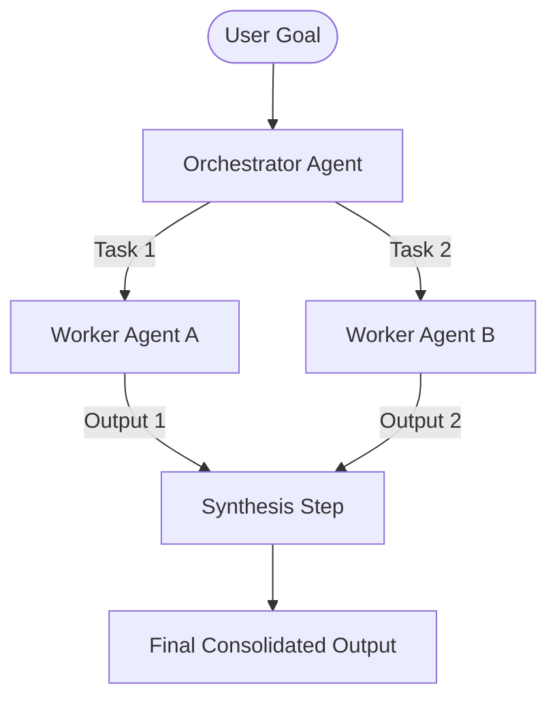

# Orchestrator-Workers

## Overview
"Orchestrator-Workers" is a design pattern where a central supervisor agent (the Orchestrator) dynamically breaks down a complex high-level objective into discrete subtasks, delegates them to multiple specialized worker agents, and synthesizes their outputs into a unified result.

## Prerequisites
- [Prompt Engineering](prompt-engineering.md) (Intermediate) - Instructing worker agents and defining output schemas.
- [Agent Hand-offs](agent-hand-offs.md) (Intermediate) - Transferring tasks between supervisor and workers.

## Core Concepts
- **Decomposition**: Breaking down a complex, multi-faceted task into independent subtasks.
- **Delegation**: Distributing subtasks to specialized workers, potentially executing them in parallel.
- **Synthesis**: The Orchestrator gathers, reviews, and combines worker outputs into a single final deliverable.

## In-Depth Guide

### The Orchestration Loop
The Orchestrator-Workers workflow is characterized by centralized delegation and merging:

### When to Use
- **Dynamic Subtasks**: When the exact steps needed to solve a problem cannot be predicted in advance.
- **Parallel Workflows**: When subtasks (e.g. writing individual code files or scanning different websites) can run concurrently.
- **Synthesized Output**: When multiple perspectives or components must be merged into a single consistent response.

## Verification
To verify this skill:
1. Assign a complex task (e.g., "Write a landing page with HTML, CSS, and JS files").
2. Confirm the Orchestrator splits the task into individual files.
3. Spawn worker agents to write each file.
4. Verify that the Orchestrator merges them into a cohesive workspace and verifies the final result.
