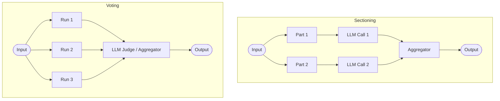

# Parallelization

## Overview
"Parallelization" is a workflow pattern that runs multiple LLM calls concurrently to solve a task. The results from these parallel runs are then aggregated or filtered. This pattern is split into two primary sub-patterns: sectioning (decomposing a task into independent sub-tasks run in parallel) and voting (generating multiple candidates for the same task and selecting the best one).

## Prerequisites
- [Prompt Engineering](prompt-engineering.md) (Intermediate) - For structuring prompts and output templates that can be easily merged.

## Core Concepts
- **Sectioning (Task Partitioning)**: Dividing a large input or task into independent chunks that can be processed simultaneously (e.g. summarizing chapters of a book).
- **Voting (Consensus)**: Requesting multiple independent runs of the same prompt to get a variety of answers, then choosing or merging the best response (e.g., using LLM judge or majority vote).
- **Aggregation**: The logic to combine, filter, or select from the parallel outputs.

## In-Depth Guide

### Parallelization Architectures

### Why use Parallelization?
1. **Low Latency**: Processes tasks concurrently rather than sequentially, reducing overall time-to-output.
2. **Diverse Insights**: In voting, generates multiple independent lines of reasoning, increasing the probability of correctness.
3. **Scalability**: Allows processing large documents or high-volume tasks by fan-out.

## Verification
To verify this skill:
1. Implement a parallel sectioning pipeline (e.g., split a 2-paragraph text and summarize each paragraph concurrently).
2. Combine the summaries into a final coherent synopsis.
3. Verify that both sections were summarized in parallel and correctly aggregated.
