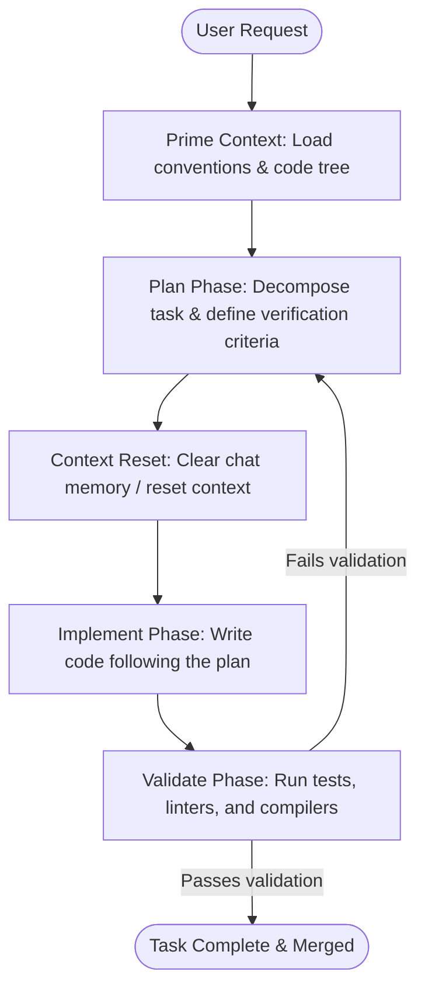

# Plan-Implement-Validate Loop (PIV Loop)

## Overview
The Plan-Implement-Validate (PIV) Loop is an agentic software engineering pattern designed to enforce structure and predictability in AI-assisted development. Popularized by AI agent educator Cole Medin, it addresses "vibe coding" (making ad-hoc edits without planning or testing) by explicitly decoupling a development task into three distinct stages: Planning (context priming and strategy design), Implementation (focused execution with minimized context), and Validation (rigorous checking of outputs against requirements).

## Prerequisites
- [Prompt Engineering](prompt-engineering.md) (Intermediate) - For structuring clear requirements and instructions.
- [LLM Wiki](llm-wiki.md) (Intermediate) - For maintaining repository conventions and schemas.
- [Test-Driven Development](test-driven-development.md) (Advanced) - As a primary mechanism for the Validation phase.

## Core Concepts
- **Context Priming**: Loading all relevant repo-level context, requirements, and constraints (often via a custom `/prime` or `/init` command) before starting.
- **The Planning Phase**: Generating a structured implementation plan and defining the validation criteria *before* modifying code.
- **Context Reset**: Clearing or resetting the AI agent's active context window between the Planning and Implementation phases to avoid prompt bloat, distraction, and hallucination.
- **The Implementation Phase**: The developer agent executing the agreed plan with a high degree of focus, strictly avoiding scope creep.
- **The Validation Phase**: Running tests, linters, and verification scripts to confirm the changes compile, run, and meet the plan's criteria.

## In-Depth Guide
### The PIV Loop Architecture

### Phase Details
1. **Planning**:
   - The user provides requirements (e.g., a ticket, bug report, or feature spec).
   - The agent reads files, inspects the codebase, and drafts an implementation plan.
   - Crucially, this plan includes a *Validation Strategy* (e.g., "We will write unit test X and run script Y").
2. **Context Resetting**:
   - In long conversations, LLMs accumulate noisy context, increasing latency and likelihood of bugs. 
   - Before executing code, the developer resets or clears the active conversation history and starts a fresh session loaded *only* with the target files, the repository rules, and the generated plan.
3. **Implementation**:
   - The agent executes the plan line-by-line.
   - It remains focused strictly on the files outlined in the plan.
4. **Validation**:
   - Run compilation, test suites, and linters.
   - Run the custom validation script designed in the Planning phase.
   - If tests fail, the loop starts over (either updating the plan or correcting the implementation).

## Verification
To verify this skill:
1. Initiate a coding task and verify the agent first generates an implementation plan along with a defined validation strategy (e.g., specific test commands to run).
2. Confirm the agent instructs the user to reset the session or performs a context-clearing step before initiating the code edits.
3. Confirm that after edits, the agent runs the validation commands specified in the plan and reports the test results before finalizing the task.
