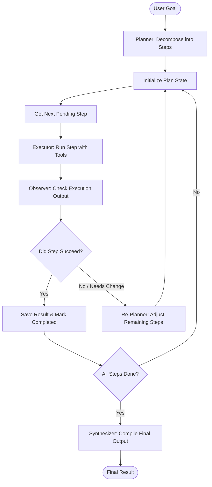

# Plan-and-Execute

## Overview
Plan-and-Execute is an agentic design pattern that decouples the strategic high-level planning of a task from its low-level execution. Instead of reasoning step-by-step in a single, unstructured loop (like the [Reason and Act](reason-and-act.md) pattern), a Plan-and-Execute agent first generates a comprehensive plan mapping out the required steps, then executes those steps sequentially, using a dynamic re-planner to modify the course of action if sub-tasks fail or requirements change.

## Prerequisites
- [Prompt Engineering](prompt-engineering.md) (Intermediate) - Designing structured prompts for planning and task decomposition.
- [Reason and Act](reason-and-act.md) (Intermediate) - ReAct-style execution of individual tasks in the plan.
- [Goal-Driven Execution](goal-driven-execution.md) (Advanced) - Maintaining context and monitoring progress during long-running tasks.

## Core Concepts
- **Planner**: A highly capable LLM that analyzes the user's objective and decomposes it into a list of distinct, structured sub-tasks.
- **Executor**: An agent (often a faster, cheaper LLM or specialized script) that takes a single sub-task and executes it using available tools.
- **Re-planner / Supervisor**: A monitoring loop that reviews the output of each execution step, updating the remaining plan if a step fails or if new information is discovered.
- **Plan State**: A shared data structure containing the original goal, the current plan steps, their execution status (pending, in-progress, completed, failed), and the outputs of completed steps.

## In-Depth Guide

### The Plan-and-Execute Loop
The workflow separates planning, execution, and monitoring:

### When to Use
- **Complex, Long-Horizon Goals**: Tasks like building a full-stack feature, performing market research, or compiling a multi-chapter report.
- **Structured Workflows**: Environments where steps have explicit dependencies and order matters.
- **Cost & Latency Optimization**: Allowing a large model to define the plan once, while a smaller model handles the execution of individual steps.

## Verification
To verify this skill:
1. Provide a complex request that requires multiple distinct actions (e.g., "Find the latest news on AI agents, summarize the top 3 articles, and format them into a markdown newsletter").
2. Verify that the agent first outputs a structured list of planning steps before calling any tools.
3. Simulate a failure in one of the middle steps (e.g., block search access) and verify that the agent re-plans to use an alternative resource without losing progress on the already-completed steps.
