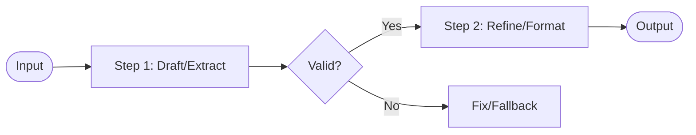

# Prompt Chaining

## Overview
"Prompt Chaining" is a workflow pattern that decomposes a complex task into a sequence of steps, where the output of one LLM call serves as the input for the next. This pattern enhances reliability and quality by enabling programmatic validation checks, formatting, and structured adjustments between steps, avoiding the failures of single-turn complex prompts.

## Prerequisites
- [Prompt Engineering](prompt-engineering.md) (Intermediate) - For writing precise prompts at each node of the chain.

## Core Concepts
- **Sequential Execution**: Running LLM calls one after another, passing the output of the prior step to the next.
- **Programmatic Interventions**: Validation, filtering, parsing, or transformation of intermediate outputs before they are sent to the next LLM step.
- **State Propagation**: Passing relevant context along the chain while discarding noise.

## In-Depth Guide

### The Prompt Chaining Architecture
In a prompt chain, tasks are solved like an assembly line:

### Why use Prompt Chaining?
1. **Reduces Complexity**: Lower token cost per call and higher accuracy by focusing the model on one simple task at a time.
2. **Programmatic Controls**: You can run assertions (e.g. check JSON structure, substring match, length limits) after each step.
3. **Optimized Prompts**: Different steps can use different instructions, system prompts, or even different models.

## Verification
To verify this skill:
1. Initialize a sequence of two LLM steps (e.g. Step 1: extract main keywords from a text; Step 2: write a short summary using only those keywords).
2. Insert a programmatic validator between Step 1 and Step 2 to ensure the keywords list is not empty.
3. Run a test input and verify the keywords are successfully extracted and correctly used in the final summary.
