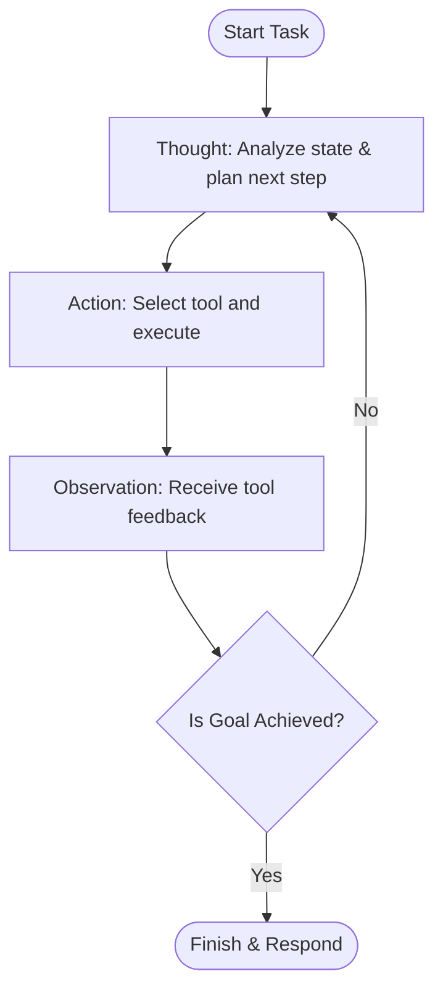

# Reason and Act

## Overview
"Reason and Act" (ReAct) is a foundational design pattern where an agent alternates between reasoning steps (Thought) and action execution (Act / Observation) in a loop to accomplish a task. This structure enables the model to perform dynamic planning, query tools, and adjust its execution path based on real-time external feedback.

## Prerequisites
- [Prompt Engineering](prompt-engineering.md) (Intermediate) - Techniques for structuring thought-action-observation loops.
- [Model Context Protocol](model-context-protocol.md) (Intermediate) - For secure tool integration and execution.

## Core Concepts
- **Thought**: The reasoning phase where the agent analyzes the current state and determines what action to take next.
- **Action**: The execution phase where the agent calls an external tool with specific parameters.
- **Observation**: The feedback phase where the agent receives and parses the tool's output to update its internal state.
- **Stop Condition**: The final step when the agent determines that the goal has been achieved and yields the result.

## In-Depth Guide

### The ReAct Cycle
The ReAct loop structure is characterized by sequential reasoning and action:



### Prompt Template
A typical prompt structure to enforce the ReAct loop:

```text
Use the following format:
Task: the input task you must solve
Thought: you should always think about what to do
Action: the action to take (should be one of [tool_name])
Action Input: the input to the action
Observation: the result of the action
... (this Thought/Action/Action Input/Observation can repeat N times)
Thought: I now know the final answer
Final Answer: the final answer to the original input task
```

## Verification
To verify this skill:
1. Initialize an agent equipped with access to a calculation or search tool.
2. Request a multi-step query requiring external knowledge (e.g., "Find the population of France and multiply it by 1.5").
3. Verify that the agent generates a sequence of Thought -> Action -> Observation steps before arriving at the final response.
