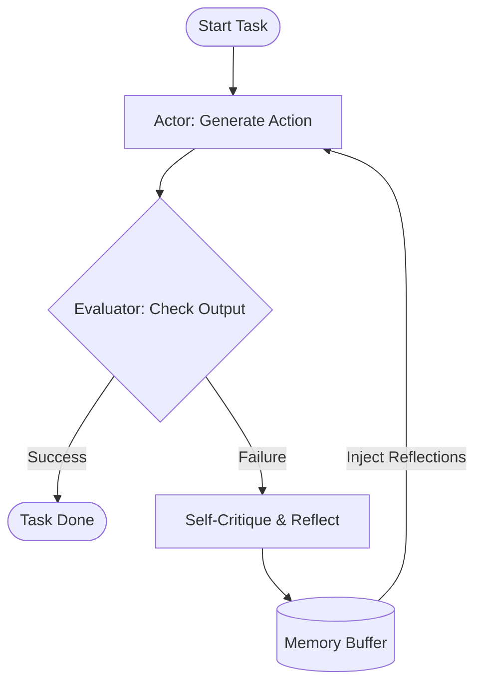

# Reflexion

## Overview
Reflexion is an agentic design pattern that equips LLM agents with dynamic memory and verbal self-correction capabilities. Instead of executing actions in a single shot or running a stateless check, a Reflexion agent evaluates its execution outcomes (such as test failures or task errors), logs a verbal reflection of what went wrong and how to fix it in a persistent memory buffer, and leverages this history to refine its approach in subsequent attempts.

## Prerequisites
- [Prompt Engineering](prompt-engineering.md) (Intermediate) - For writing precise critique prompts and constraints.
- [Reason and Act](reason-and-act.md) (Intermediate) - For the base execution loop that Reflexion wraps.
- [Evaluator-Optimizer](evaluator-optimizer.md) (Advanced) - For the feedback generation concepts.

## Core Concepts
- **Actor**: The agent component that takes actions and generates trials based on the prompt, execution state, and past reflection history.
- **Evaluator**: A component (such as an external script, compiler, or separate LLM) that checks the Actor's output and determines if the goal was successfully met.
- **Self-Reflection (Self-Critique)**: The process where the agent analyzes its current failure trace and generates a verbal summary of its mistakes and a concrete plan for correction.
- **Episodic Memory**: A buffer containing the verbal reflections of previous failed trials, which is injected into the Actor's context window for subsequent trials.

## In-Depth Guide
### The Reflexion Loop
1. **Initialize**: Set trial counter to 0 and empty the reflection memory.
2. **Execute Trial**: The Actor generates a solution using the initial prompt and any prior reflections in memory.
3. **Evaluate**: The Evaluator scores the outcome. If it passes or succeeds, the loop terminates.
4. **Reflect**: If the outcome fails, the Actor takes the input, output, and failure trace to construct a self-reflection explaining the failure and detailing how to avoid it.
5. **Store**: Save the new self-reflection into the memory buffer.
6. **Iterate**: Increment trial counter and repeat from Step 2, providing the Actor with the accumulated reflections.

## Verification
To verify this skill:
1. Run a coding task where the first attempt has a syntax or logical bug.
2. Verify the agent captures the compiler/test error.
3. Verify the agent writes a markdown critique of its own code.
4. Verify that in the next iteration, the agent references this critique and successfully fixes the bug.
