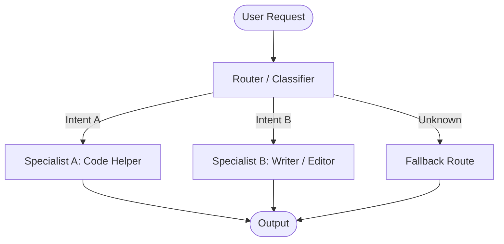

# Routing

## Overview
"Routing" is a design pattern that uses a classification step to direct incoming inputs to the most appropriate specialized process, prompt, or downstream agent. This pattern acts as a traffic controller, optimizing system cost, latency, and accuracy by ensuring tasks are handled by resources specifically designed for them.

## Prerequisites
- [Prompt Engineering](prompt-engineering.md) (Intermediate) - For writing precise classifier prompts and formatting options.

## Core Concepts
- **Classifier**: The decision-making step (e.g. LLM call, regex, or router script) that identifies the intent of the input.
- **Route Mapping**: The dictionary or conditional structure mapping intents to specialized workflows or agents.
- **Default Fallback**: A catch-all route to handle ambiguous or out-of-domain requests safely.

## In-Depth Guide

### The Routing Architecture
Routing intercepts incoming queries and directs them to the optimal path:

### Static vs. Dynamic Routing
1. **Static / Hardcoded Routing**: Done via simple string matching, regex, or metadata keys. High speed, no additional cost.
2. **Dynamic / LLM-Based Routing**: Done by asking an LLM to categorize the input intent from a set of choices. Higher flexibility, handles nuanced natural language.
3. **Semantic / Embedding-Based Routing**: Matches the query vector against pre-defined cluster centroids or examplar vectors. Fast, cost-efficient, handles natural language variation without LLM calls.

## Verification
To verify this skill:
1. Initialize a routing setup with specialized paths (e.g. Coding, General Chat, Billing).
2. Send diverse test queries (e.g., "how do I write a fast sort in Python", "tell me a joke").
3. Verify the Router correctly classifies the query and routes it to the correct specialized pathway.
