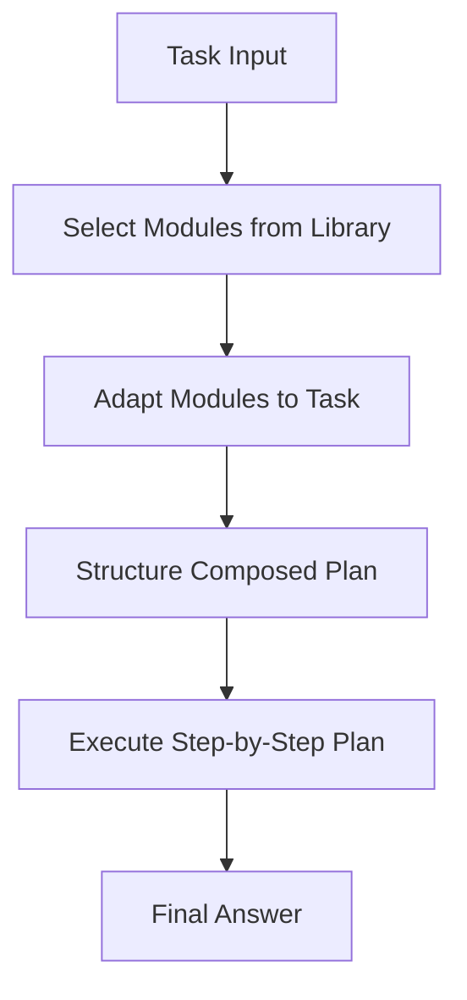

# Self-Discovery

## Overview
Self-Discovery is an agentic pattern where the LLM selects and composes its own reasoning structure to solve a given task. Instead of relying on a hardcoded reasoning path (such as Chain-of-Thought or Plan-and-Execute), the agent analyzes the task, selects appropriate cognitive building blocks from a predefined library (such as "critical thinking", "perspective taking", "decomposition"), and structures them into an execution plan custom-tailored to the task's unique demands.

## Prerequisites
- [Prompt Engineering](prompt-engineering.md) (Intermediate) - To define and steer custom reasoning modules.
- [Plan-and-Execute](plan-and-execute.md) (Advanced) - To execute the composed plan.

## Core Concepts
- **Reasoning Modules Library**: A curated set of core cognitive strategies, including decomposition, analogical reasoning, critical thinking, step-by-step auditing, and constraint analysis.
- **Stage 1: Discovery (Select, Adapt, Structure)**:
  - **Select**: Query the LLM to choose which reasoning modules are relevant.
  - **Adapt**: Modify the chosen modules to fit the specific details of the task.
  - **Structure**: Combine the adapted modules into a cohesive, structured execution flowchart.
- **Stage 2: Execution**: Execute the customized reasoning flowchart to produce the final answer.

## In-Depth Guide
### The Self-Discovery Process
1. **Analyze Task**: Read the problem definition and identify its core difficulties.
2. **Select Modules**: Review the library of cognitive modules and select 3-5 modules (e.g., Use first-principles thinking, Identify missing info, Perform sanity checks).
3. **Adapt Modules**: Customize the selected modules specifically to the target problem.
4. **Structure Workflow**: Organize the adapted modules into a step-by-step flowchart or checklist.
5. **Execute**: Run through the customized checklist to solve the problem.

## Verification
To verify this skill:
1. Provide a complex, ambiguous problem (e.g., cross-disciplinary design).
2. Verify the agent lists the specific cognitive modules it intends to use before planning.
3. Verify the generated reasoning structure is specifically customized to the prompt details.
4. Verify execution follows the custom reasoning plan step-by-step.
