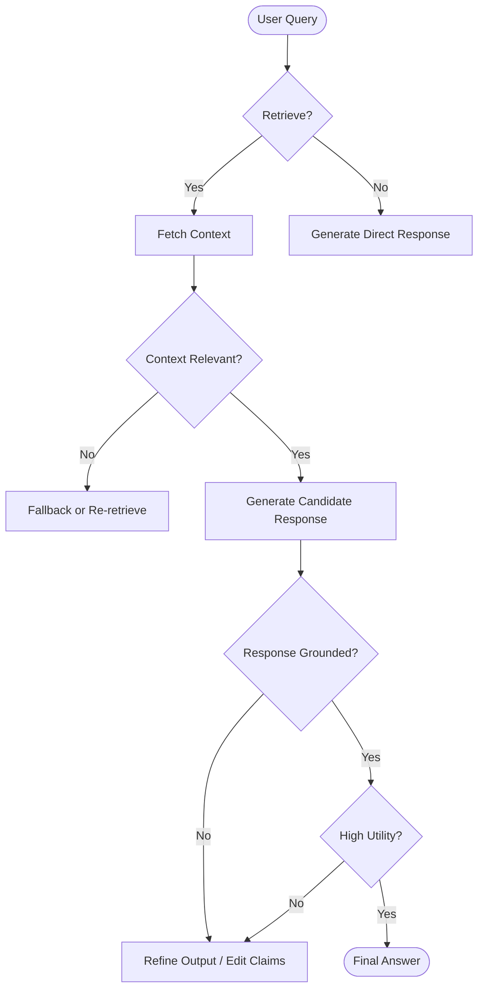

# Self-Reflective Retrieval-Augmented Generation (Self-RAG)

## Overview
Self-Reflective Retrieval-Augmented Generation (Self-RAG) is an advanced RAG framework that improves generation quality by training or prompting the agent to generate reflective tokens (or perform internal evaluations) to evaluate the relevance of retrieved documents, verify the factual grounding of its own generated sentences, and critique the overall utility of its responses.

## Prerequisites
- [Corrective RAG](corrective-rag.md) (Advanced) - For fallbacks on low retrieval relevance.
- [Reflexion](reflexion.md) (Advanced) - For iterative self-correction loops.

## Core Concepts
- **Adaptive Retrieval**: The agent dynamically decides whether to retrieve documents based on the input query's need for external knowledge.
- **Relevance Grading**: Checking if the retrieved context is relevant to the prompt.
- **Grounding Assessment**: Ensuring every claim in the generated response is directly supported by the retrieved context (no hallucinations).
- **Utility Assessment**: Evaluating if the response directly and fully answers the user query.

## In-Depth Guide

### Workflow Loop
The execution flow of a Self-RAG agent is shown below:



### Self-Reflection Prompts
Self-RAG uses evaluation prompts to grade grounding:
```markdown
Grade whether the generated statement is supported by the retrieved document.
Retrieved Document: {document}
Statement: {statement}
Response: {"grounded": true | false, "unsupported_claims": [...]}
```

## Verification
To verify this skill:
1. Input a query requiring specific facts (e.g. "What is the memory limit of a Firebase Cloud Function Gen 2?").
2. Verify the agent retrieves documents, grades relevance, and generates an answer.
3. Conduct a grounding check to verify that every sentence in the output can be mapped back to a line in the retrieved Firebase documentation.
