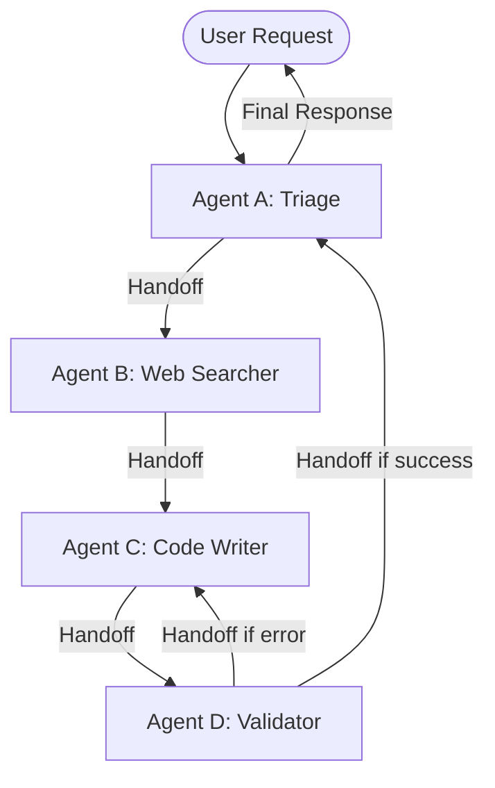

# Swarm Orchestration

## Overview
Swarm Orchestration is a decentralized multi-agent coordination pattern where autonomous, single-purpose agents interact and hand off tasks directly to each other without a rigid central supervisor or orchestrator. By returning dynamic control signals (e.g., indicating which agent to transition to next), agents route execution flow collaboratively, allowing highly flexible, open-ended problem solving.

## Prerequisites
- [Agent Hand-offs](agent-hand-offs.md) (Intermediate) - To transition control between agents.
- [Routing](routing.md) (Intermediate) - For classification and decision-making on target agents.

## Core Concepts
- **Decentralized Control**: Execution logic and routing decisions are distributed across individual agents, rather than controlled by a single master supervisor.
- **Dynamic Handoffs**: Agents return execution results along with a reference to the next specialized agent that should run.
- **Shared Context / State**: A shared memory space (or thread context) that travels with the active agent, ensuring continuation of state.
- **Task Decomposition**: Dividing complex, multi-faceted problems into simple, localized tasks handled by specialized micro-agents.

## In-Depth Guide

### The Swarm Execution Flow
Unlike the centralized Orchestrator-Worker model, Swarm Orchestration moves control fluidly from agent to agent:

### Implementing Swarm Communication
To achieve robust swarm coordination:
1. **Define Clean Agent Interfaces**: Each agent receives the current task state, performs its action, and returns its result along with the next agent's identifier.
2. **Standardize Context Updates**: Ensure updates to shared state are additive and structured.
3. **Handle Infinite Loops**: Implement maximum step guardrails to prevent agents from handing off back-and-forth indefinitely without progress.

## Verification
To verify this skill:
1. Setup a multi-agent system where Agent A performs triage and hands off to Agent B.
2. Verify that Agent B runs its task, modifies the shared context, and determines the next step (Agent C or return to triage).
3. Confirm that control successfully reaches the end state and the final response is returned to the user without any central orchestration script hard-coding the sequence.
