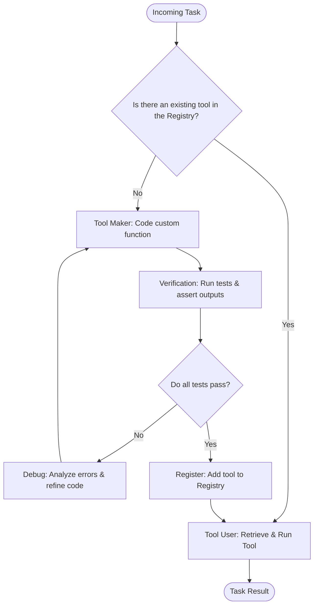

# Tool Maker

## Overview
The Tool Maker pattern, also known as LLM As Tool Maker (LATM), is a dynamic agent design pattern where an agent autonomously creates, debugs, tests, and registers its own tools (typically as Python functions or APIs) to solve complex or repetitive tasks. Instead of relying on a hard-coded set of tools or trying to solve a mathematical/procedural task via raw text generation, the agent acts as a software developer, writing a specialized utility code block and executing it directly to get highly accurate results at a lower token cost.

## Prerequisites
- [Prompt Engineering](prompt-engineering.md) (Intermediate) - Instructing the model to generate correct code and schemas.
- [Model Context Protocol](model-context-protocol.md) (Intermediate) - Standardized API or execution endpoints to execute generated tools.
- [Test-Driven Development](test-driven-development.md) (Advanced) - Writing assertion tests to validate the generated tools before registering them.

## Core Concepts
- **Creator (Tool Maker)**: A highly capable LLM that writes, tests, and refines a python function to solve a specific class of problems.
- **User (Tool User)**: A lightweight, cost-effective LLM that identifies when a registered tool is needed and executes it with appropriate parameters.
- **Tool Registry / Cache**: A local library where generated and verified tools are stored for future reuse, minimizing redundant tool creation.
- **Verification Loop**: An automated execution check that runs the generated tool against sample inputs and assertions to ensure correctness before integration.

## In-Depth Guide

### The Tool-Making & Tool-Using Loop
The workflow splits the heavy task of tool creation from the lightweight task of tool execution:

### When to Use
- **Repetitive Calculations**: Custom mathematical formulas, date-time manipulation, or coordinate transformation.
- **Custom Parsing**: Extracting info from complex, non-standard file formats.
- **API Wrappers**: Dynamically creating integration functions for newly discovered web APIs.
- **Cost Reduction**: Reusing a static, compiled code block instead of asking a heavy model to perform complex reasoning repeatedly.

## Verification
To verify this skill:
1. Provide the agent with a task that requires a highly specific procedural computation (e.g., "Find the number of weekdays between two arbitrary dates, excluding a custom list of holidays").
2. Verify that the agent recognizes that no existing tool supports this, writes a Python script to calculate it, runs a verification test on the script, registers it, and executes it to return the correct count.
3. Provide a similar task for a different set of dates and confirm that the agent reuses the registered tool directly from its cache rather than generating code again.
