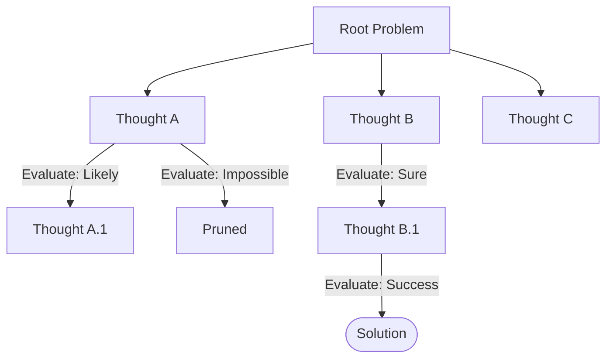

# Tree of Thoughts

## Overview
Tree of Thoughts (ToT) is a reasoning framework that generalizes Chain-of-Thought prompting by allowing LLMs to explore multiple alternative reasoning paths. It models problem-solving as a search tree, where each node is a "thought" representing an intermediate step toward a solution. The agent can generate new thoughts, evaluate their feasibility, and apply standard search algorithms (like Depth-First Search or Breadth-First Search) to backtrack and prune unpromising paths.

## Prerequisites
- [Prompt Engineering](prompt-engineering.md) (Intermediate) - For structuring thought generation and evaluation prompts.
- [Parallelization](parallelization.md) (Intermediate) - For generating multiple candidate thoughts in parallel.

## Core Concepts
- **Thought Generator**: An LLM prompt template that proposes multiple potential next steps (thoughts) given the current state.
- **State Evaluator**: An LLM template or deterministic function that evaluates the viability of a thought state, assigning a grade (e.g., Sure, Likely, Impossible).
- **Search Algorithm**: A control flow logic (BFS, DFS) that coordinates generation and evaluation to traverse the tree of thoughts.
- **Backtracking**: Returning to a previous parent node when all children of the current node are deemed "Impossible".

## In-Depth Guide
### The Tree of Thoughts Workflow
1. **Deconstruct**: Divide the overall problem into discrete reasoning steps.
2. **Generate Candidates**: At the current state, generate 3-5 potential next steps.
3. **Evaluate**: Rate each candidate state. Prune any that are marked invalid/impossible.
4. **Select & Proceed**: Choose the best-rated candidate(s) to expand.
5. **Backtrack if Blocked**: If a branch leads to a dead end, backtrack to the last viable parent state and explore alternative paths.

## Verification
To verify this skill:
1. Provide a logic puzzle, math problem, or planning task with multiple branch choices.
2. Check that the agent lists at least 3 distinct options for the initial step.
3. Verify that the agent critiques each option and prunes the least viable ones.
4. Confirm that the agent backtracks when a chosen path fails, choosing a previously rejected alternative.
