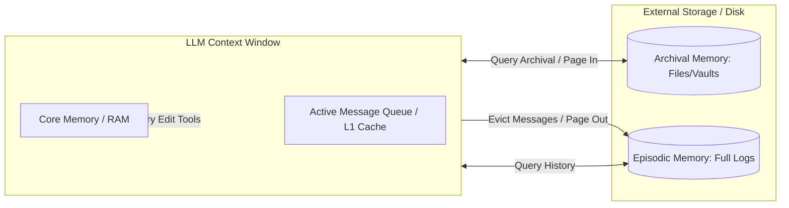

# Virtual Context Management

## Overview
Virtual Context Management is an architectural pattern (pioneered by MemGPT) that allows AI agents to operate beyond physical context window limits. It structures agent memory similarly to operating system virtual memory: the immediate context window acts as RAM (Core Memory), while external storage databases act as disk storage (Archival and Episodic Memory). The agent is given explicit tools to programmatically load (page in) or write (page out) memory blocks, facilitating perpetual execution and long-term state management.

## Prerequisites
- [LLM Wiki](llm-wiki.md) (Intermediate) - For database operations and document ingestion.
- [Memory Consolidation](memory-consolidation.md) (Advanced) - For summarizing and distilling data to prevent memory overflow.

## Core Concepts
- **Core Memory (RAM)**: The immediate context loaded into the LLM system prompt. Typically divided into a fixed system block, user profile block, and agent persona block.
- **Archival Memory (Disk)**: Read-only external storage containing historical files, large documents, or static facts. Accessible via vector searches or full-text indexes.
- **Episodic Memory (Disk)**: A chronological log of all past agent execution steps, inputs, outputs, and tool observations.
- **Paging / Context Swapping**: The mechanism where the agent runs a tool to write data out to disk or retrieve data into core memory, keeping the active context window clean and small.

## In-Depth Guide

### Memory Architecture
The relationship between memory tiers and the LLM context is diagrammed below:



### Context Swapping Tools
The agent uses standard functions to edit core memory blocks dynamically:
```json
{
  "name": "core_memory_append",
  "arguments": {
    "section": "user_profile",
    "content": "User prefers python instead of javascript."
  }
}
```

## Verification
To verify this skill:
1. Provide the agent with a long conversation stream that exceeds its physical context window.
2. Verify that the agent detects context limits, compiles older messages, writes them to Episodic Memory (paging out), and removes them from the active message history.
3. Query the agent on a detail from the evicted messages (e.g. "What did we talk about in step 3?").
4. Confirm that the agent invokes a retrieval tool to search its Episodic Memory (paging in) and answers the question accurately.
